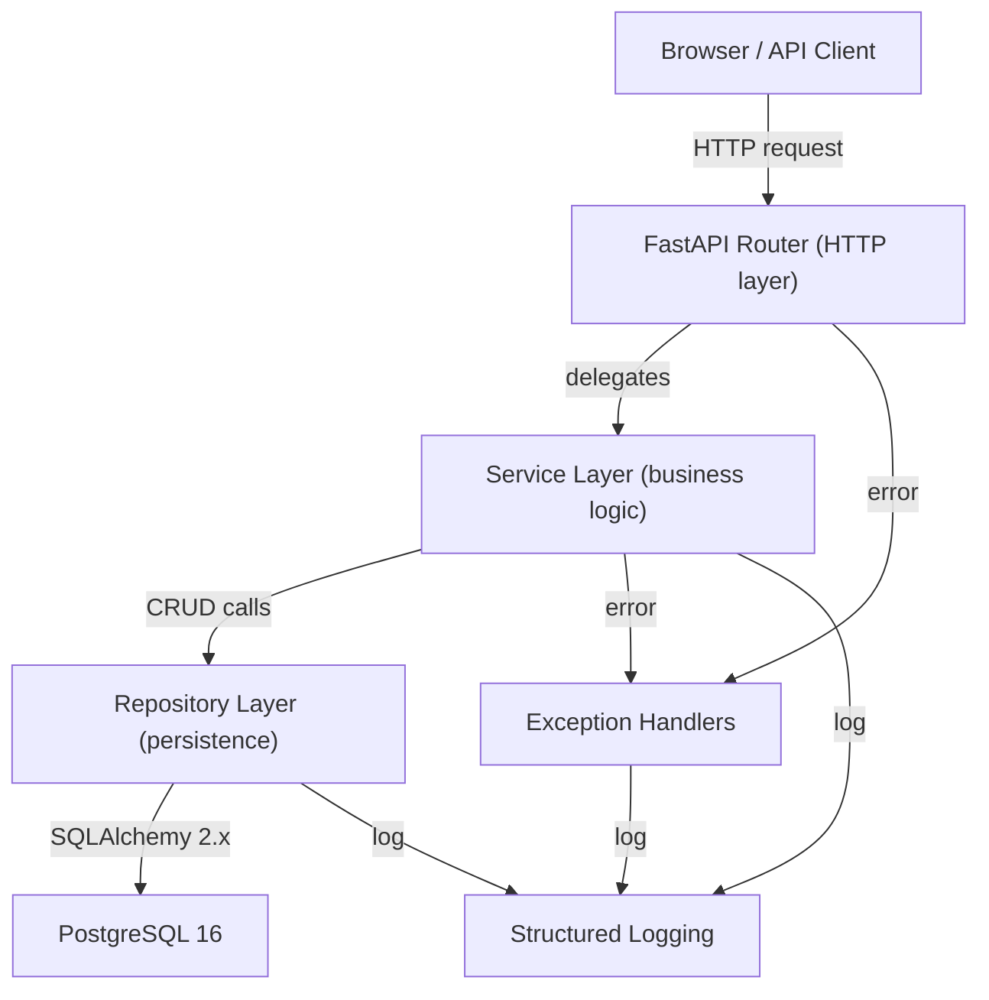
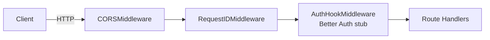
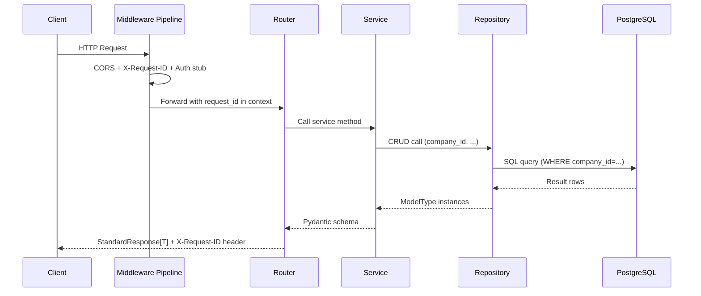
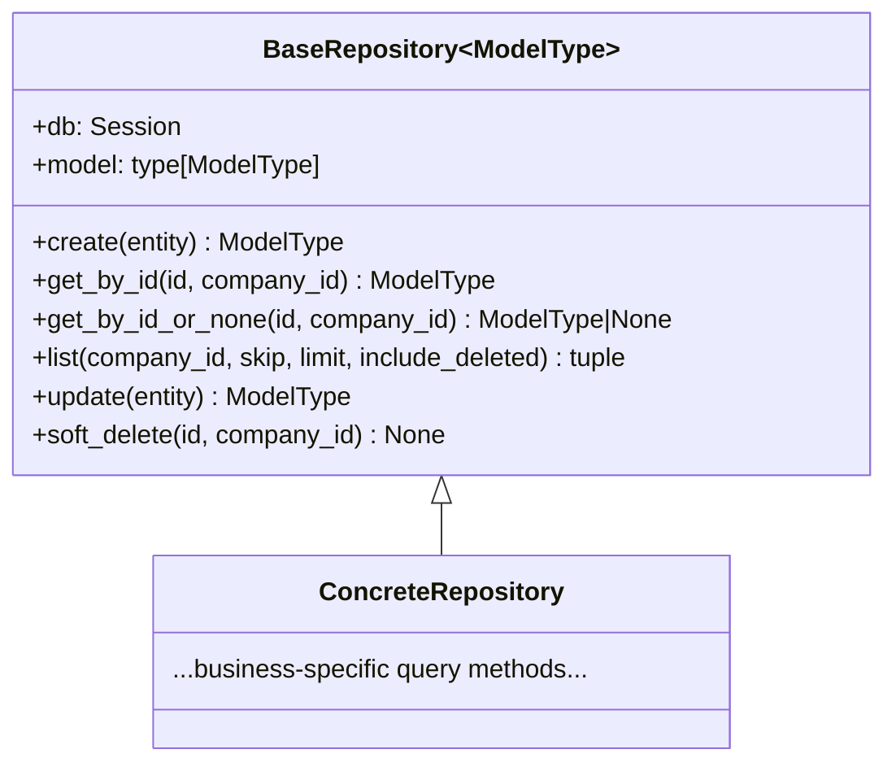
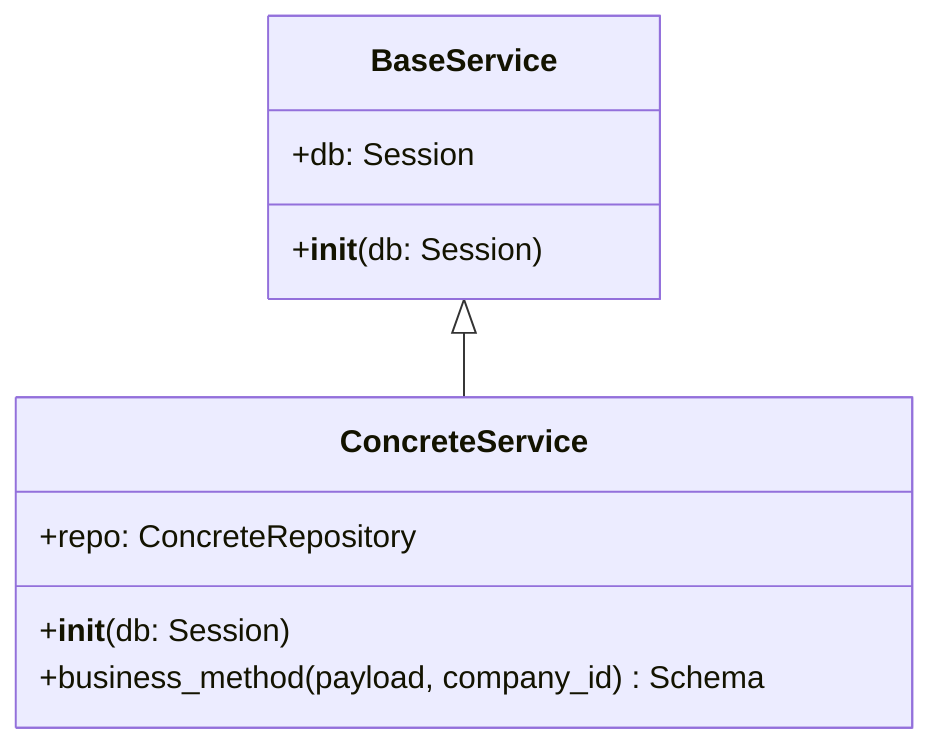
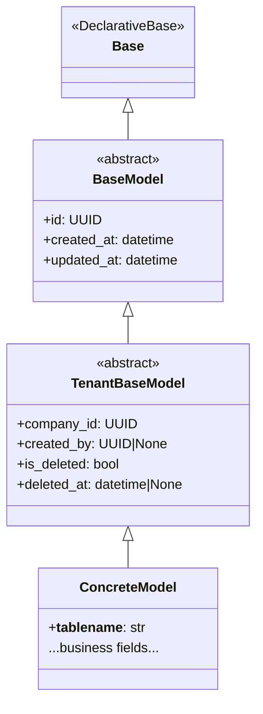
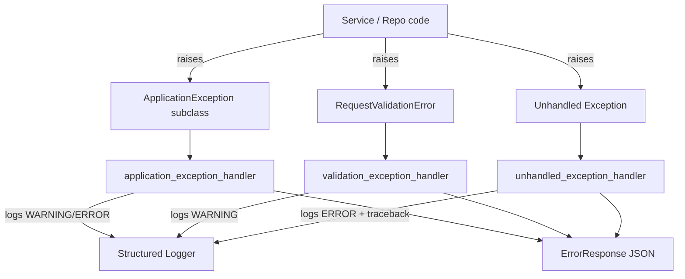
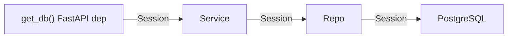
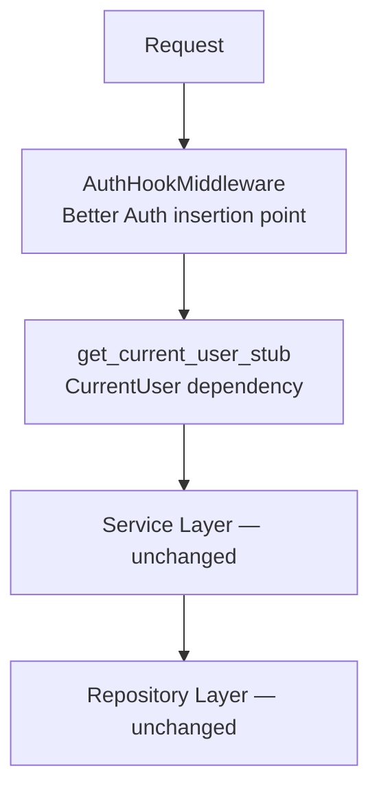

# Architecture Overview — DevSphere ERP

**Last Updated**: 2026-07-11 | **Phase**: Epic 1 — Foundation Platform (Phases 0–8 complete)

---

## High-Level Architecture

DevSphere ERP is a **Modular Monolith** with a clear migration path to microservices. The system separates concerns into distinct layers. Each layer has a single responsibility and depends only on the layer below it.



---

## Layer Responsibilities

| Layer | Location | Responsibility |
|-------|----------|---------------|
| **Router** | `api/v1/` | Parse HTTP, validate schema, call service, return response |
| **Service** | `core/services/`, `modules/*/services/` | Business rules, orchestration, transactions |
| **Repository** | `core/repositories/`, `modules/*/repositories/` | SQL queries, pagination, soft-delete, tenant filter |
| **Models** | `core/database/models/` | SQLAlchemy ORM definitions |
| **Schemas** | `core/schemas/` | Pydantic request/response models |
| **Exceptions** | `core/exceptions/` | Error hierarchy, global handlers |
| **Logging** | `core/logging/` | Structured JSON (prod) / coloured (dev) |

---

## Middleware Pipeline

See [`middleware.md`](middleware.md) for full details.



Pipeline registration order (LIFO — last added = outermost):
1. `AuthHookMiddleware` — innermost, future Better Auth insertion point
2. `RequestIDMiddleware` — assigns/propagates X-Request-ID
3. `CORSMiddleware` — outermost, handles preflight

---

## Request Flow

See [`request-flow.md`](request-flow.md) for the complete lifecycle diagram.



---

## Repository Pattern

See [`repository-pattern.md`](repository-pattern.md) for full details.



**Contract**: Every read/write method requires `company_id`. No cross-tenant queries are possible.

---

## Service Layer

See [`service-layer.md`](service-layer.md) for full details.



---

## Database Layer



---

## Exception Flow



---

## Logging Flow

| Environment | Format | Destination |
|-------------|--------|-------------|
| `production` | JSON (one line per record) | stdout (aggregated by infrastructure) |
| `development` | Coloured human-readable | stdout |

Every log record includes `request_id` (from `REQUEST_ID_CONTEXT` ContextVar), `timestamp`, `level`, `logger`, `message`, `environment`.

---

## Dependency Injection



`get_db()` yields one `Session` per request and closes it in the `finally` block. Services and repositories share this session so all operations in a request participate in the same transaction.

---

## Authentication Architecture

See [`authentication.md`](authentication.md) for the full design.



`core/auth/interfaces.py` defines `CurrentUser`, `SessionContext`, `AuthenticationProvider`, `AuthorizationProvider`, `Permission`, `Role`, and FastAPI dependency stubs. Better Auth integration requires only changes to `AuthHookMiddleware` and `get_current_user_stub`.

---

## Health Endpoints

| Endpoint | Method | Purpose |
|---|---|---|
| `/` | GET | API metadata (name, version, environment) |
| `/api/v1/health` | GET | Combined liveness + readiness; DB check → 503 if unavailable |
| `/api/v1/health/live` | GET | Always 200 while process is running |
| `/api/v1/health/ready` | GET | 200 when DB is reachable; 503 otherwise |

---

## Completed Phases

| Phase | Deliverables | Status |
|-------|-------------|--------|
| 0 | Monorepo scaffolding, `.gitignore`, `.env.example`, `README.md` | ✅ |
| 1 | `pyproject.toml`, `Settings`, black/ruff/mypy/pre-commit | ✅ |
| 2 | `configure_logging`, `REQUEST_ID_CONTEXT`, JSON + dev formatters | ✅ |
| 3 | `engine`, `Base`, `SessionLocal`, `get_db`, `BaseModel`, `TenantBaseModel`, Alembic | ✅ |
| 4 | Exception hierarchy, `handler.py`, `StandardResponse`, `ErrorResponse`, `PaginatedResponse` | ✅ |
| 5 | `BaseRepository`, `BaseService`, utility modules (uuid, datetime, pagination) | ✅ |
| 6 | Middleware pipeline, `RequestIDMiddleware`, `AuthHookMiddleware`, auth interfaces, health endpoints, CORS, router registration | ✅ |
| 7 | `backend/Dockerfile` (multi-stage), `frontend/Dockerfile`, `docker-compose.yml` (db/api/web), `postgres_data` volume, Alembic auto-migration on startup | ✅ |
| 8 | Next.js 16 (App Router), TypeScript strict, Tailwind v4, shadcn/ui, AppLayout, API client, design tokens | ✅ |

---

## Future Module Integration

When adding a new ERP module (e.g. Inventory):

```
modules/
  inventory/
    models/
      product.py        # class Product(TenantBaseModel)
    repositories/
      product_repo.py   # class ProductRepository(BaseRepository[Product])
    services/
      product_service.py # class ProductService(BaseService)
    schemas/
      product_schema.py  # Pydantic DTOs
    api/
      product_router.py  # FastAPI router, thin HTTP layer
```

No changes to `core/` are required to add a new module.
