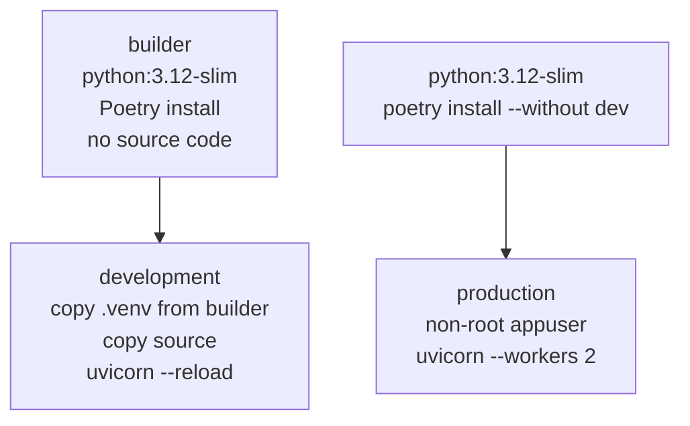

# Docker Architecture

## Overview

DevSphere ERP uses Docker and Docker Compose for local development. Production deployment is out of scope for Phase 7.

## Image Design

### Backend (`backend/Dockerfile`)

Multi-stage build with three targets:



| Stage | Base | Purpose | Non-root |
|---|---|---|---|
| `builder` | `python:3.12-slim` | Install Poetry + deps (layer cache) | No |
| `development` | `python:3.12-slim` | Hot-reload dev server | No |
| `production` | `python:3.12-slim` | Production-grade server | Yes (`appuser`) |

Key decisions:
- `.venv` built in `builder` stage; copied to `development` — avoids reinstalling deps on source changes
- `WORKDIR /app` — consistent path inside and outside Docker
- `PYTHONDONTWRITEBYTECODE=1` — no `.pyc` files in image
- `PYTHONUNBUFFERED=1` — log output is not buffered

### Frontend (`frontend/Dockerfile`)

| Stage | Base | Purpose | Non-root |
|---|---|---|---|
| `development` | `node:22-alpine` | Hot-reload dev server | No |
| `builder` | `node:22-alpine` | `npm run build` production output | No |
| `production` | `node:22-alpine` | Serve standalone Next.js output | Yes (`nextjs`) |

### .dockerignore Rules

Both images exclude:

| Pattern | Reason |
|---|---|
| `.env`, `.env.*` | Secrets must never be in images; passed via `environment:` in compose |
| `__pycache__/`, `*.pyc` | Not needed; `PYTHONDONTWRITEBYTECODE=1` prevents creation |
| `.venv/`, `node_modules/` | Installed inside the image; host copy would conflict |
| `.git/` | Not needed at runtime |
| `specs/`, `history/` | Documentation only |

## Docker Compose Architecture

See [local-development.md](local-development.md) for startup sequence and commands.

```yaml
services:
  db:   # postgres:16-alpine — waits for pg_isready
  api:  # backend development stage — waits for db healthy
  web:  # frontend development stage — depends on api
volumes:
  postgres_data:  # named volume for PostgreSQL data persistence
```

## Security Notes

1. `.env` is excluded from images via `.dockerignore` — secrets enter only via `environment:` in docker-compose.yml
2. Production stage uses non-root `appuser` / `nextjs` users
3. `postgres_data` volume is local-only; no credentials in Docker image layers
4. `SECRET_KEY` must be regenerated for each environment — never reuse the example value

## Why docker-compose.yml at Monorepo Root

Services (`db`, `api`, `web`) share a single network and environment file (`.env`). Placing `docker-compose.yml` at the root allows all services to start with a single `docker compose up` and avoids managing multiple compose files across sub-directories.
