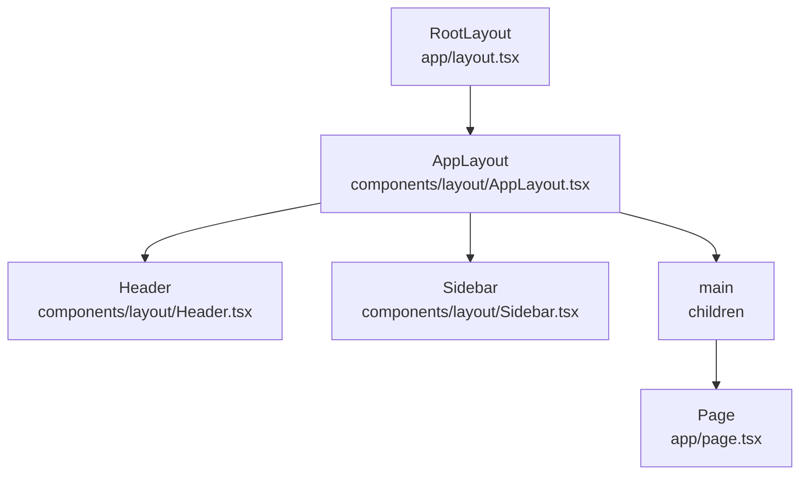
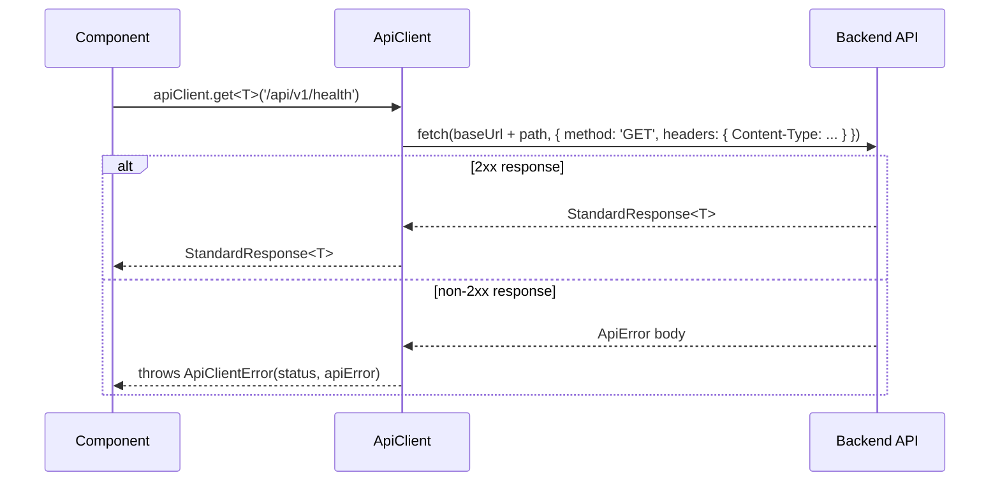

# Frontend Architecture

## Stack

| Technology | Version | Role |
|---|---|---|
| Next.js | 16.x (App Router) | React framework, routing, SSR/RSC |
| React | 19.x | UI component model |
| TypeScript | 5.x (strict) | Type safety |
| Tailwind CSS | v4 (CSS-based config) | Utility-first styling |
| shadcn/ui | latest (New York style) | Accessible component primitives |
| Geist | via `next/font` | Typography |

## Folder Structure

```
frontend/src/
├── app/                     # Next.js App Router
│   ├── layout.tsx           # Root layout — wraps everything in AppLayout
│   ├── page.tsx             # Home page placeholder
│   └── globals.css          # Tailwind v4 @theme design tokens + shadcn variables
├── components/
│   ├── ui/                  # shadcn/ui generated components (Button, Input, Card, Dialog)
│   ├── layout/              # AppLayout, Header, Sidebar
│   ├── providers/           # (future: ThemeProvider, QueryProvider, ToastProvider)
│   └── shared/              # (future: shared non-domain components)
├── lib/
│   ├── api/
│   │   ├── types.ts         # StandardResponse<T>, ApiError, PaginatedResponse<T>
│   │   └── client.ts        # ApiClient class + apiClient singleton
│   ├── config/              # (future: env config helpers)
│   └── utils/               # (future: shared utility functions)
├── hooks/                   # (future: custom React hooks)
├── styles/                  # (future: additional global styles)
└── types/
    └── index.ts             # UUID, Nullable<T>, Optional<T>
```

## Component Hierarchy



## API Client Flow



## Design Token System (Tailwind v4)

Tailwind v4 uses CSS-based configuration via `@theme` directive in `globals.css`. There is no `tailwind.config.ts`.

Design tokens defined in `src/app/globals.css`:

| Token family | Tailwind class prefix |
|---|---|
| `primary` (indigo) | `text-primary-*`, `bg-primary-*` |
| `secondary` (slate) | `text-secondary-*`, `bg-secondary-*` |
| `accent` (cyan) | `text-accent-*`, `bg-accent-*` |
| `neutral` (zinc) | `text-neutral-*`, `bg-neutral-*` |
| `success` (green) | `text-success-*`, `bg-success-*` |
| `warning` (amber) | `text-warning-*`, `bg-warning-*` |
| `error` (red) | `text-error-*`, `bg-error-*` |

shadcn/ui uses its own set of CSS variables (`--primary`, `--secondary`, `--muted`, etc.) within the `@theme inline` block, which coexist with the custom design tokens above.

## TypeScript Strict Mode

`tsconfig.json` enforces:

```json
{
  "strict": true,
  "noImplicitAny": true,
  "strictNullChecks": true,
  "noUncheckedIndexedAccess": true,
  "exactOptionalPropertyTypes": true
}
```

## ESLint (Flat Config)

`eslint.config.mjs` uses ESLint v9 flat config (not legacy `.eslintrc.json`):
- Extends `eslint-config-next/core-web-vitals` and `eslint-config-next/typescript`
- Enforces `@typescript-eslint/no-explicit-any: error`
- Enforces `@typescript-eslint/no-unused-vars: error` (with `_` prefix escape hatch)

## Placeholder Components (Future Integration Points)

| Component | File | Future use |
|---|---|---|
| `Header` | `components/layout/Header.tsx` | Navigation, user menu — Authentication Epic |
| `Sidebar` | `components/layout/Sidebar.tsx` | Module navigation links — as ERP modules are built |
| `components/providers/` | (empty) | ThemeProvider, QueryProvider, ToastProvider |

## What is NOT in Phase 8

- No ERP pages (Dashboard, Login, Company, User management)
- No authentication provider
- No TanStack Query business hooks
- No forms or tables
- No CRUD operations
- No Better Auth
