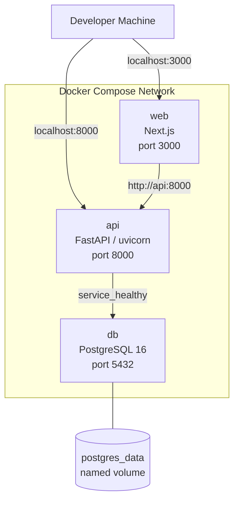
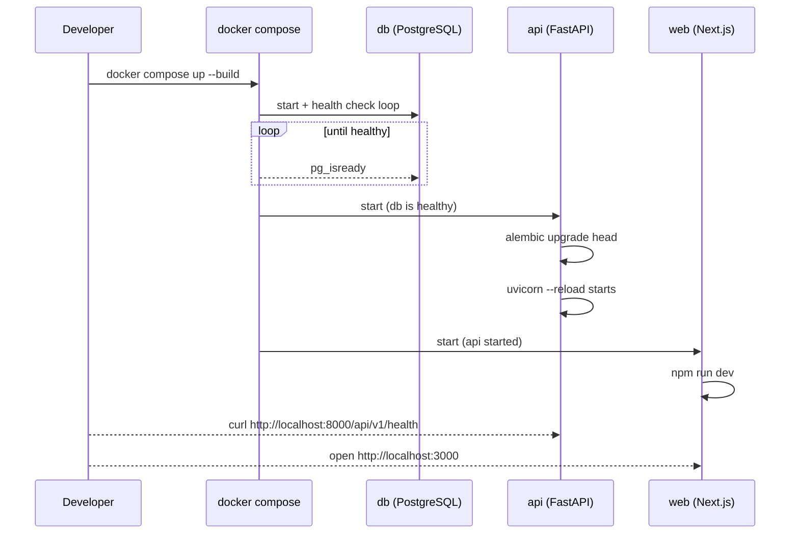

# Local Development Guide

## Quick Start

```bash
# 1. Clone and enter the repo
git clone <repo-url>
cd erp-system

# 2. Create environment file (one-time)
cp .env.example .env
# Edit .env — set SECRET_KEY to a secure random string

# 3. Start all services
docker compose up --build

# 4. Verify
curl http://localhost:8000/api/v1/health/live   # → {"status":"alive"}
curl http://localhost:8000/api/v1/health        # → {"data":{"status":"healthy",...}}
open http://localhost:3000                      # Frontend (Phase 8+)
open http://localhost:8000/docs                 # Swagger UI (DEBUG=true only)
```

## Container Architecture



## Services

### db — PostgreSQL 16

| Property | Value |
|---|---|
| Image | `postgres:16-alpine` |
| Port | `5432:5432` |
| Data volume | `postgres_data:/var/lib/postgresql/data` |
| Health check | `pg_isready -U $POSTGRES_USER -d $POSTGRES_DB` |
| Start condition for api | `service_healthy` |

### api — FastAPI Backend

| Property | Value |
|---|---|
| Build context | `./backend` (Dockerfile target: `development`) |
| Port | `8000:8000` |
| Hot reload | `--reload` flag; source mounted at `/app` |
| DB wait | Waits for `db` healthcheck to pass before starting |
| Auto-migration | `alembic upgrade head` runs on every startup via `core/migrations.py` |

### web — Next.js Frontend

| Property | Value |
|---|---|
| Build context | `./frontend` (Dockerfile target: `development`) |
| Port | `3000:3000` |
| Hot reload | Source mounted at `/app`; `node_modules` preserved as anonymous volume |
| Depends on | `api` |

## Startup Sequence



## Alembic Workflow

Alembic migrations run automatically at every API startup via `core/migrations.py`. The application is migration-safe by design: the initial baseline is idempotent.

### Manual Alembic Commands

```bash
# Inside the api container
docker compose exec api alembic current        # show current revision
docker compose exec api alembic history        # show migration history
docker compose exec api alembic upgrade head   # run pending migrations
docker compose exec api alembic downgrade -1   # roll back one revision

# From host (with DATABASE_URL set in .env)
cd backend && alembic history
```

### Creating a New Migration

```bash
docker compose exec api alembic revision --autogenerate -m "add_product_table"
# Edit the generated file in backend/migrations/versions/
docker compose exec api alembic upgrade head
```

## Volume Persistence

The `postgres_data` named volume persists data across restarts:

```bash
docker compose down          # stop containers — DATA PRESERVED
docker compose up            # restart — data still there

docker compose down -v       # stop AND delete volume — DATA WIPED
```

## Environment Variables

Copy `.env.example` to `.env` and fill in:

| Variable | Required | Description |
|---|---|---|
| `POSTGRES_DB` | Yes | PostgreSQL database name |
| `POSTGRES_USER` | Yes | PostgreSQL username |
| `POSTGRES_PASSWORD` | Yes | PostgreSQL password |
| `DATABASE_URL` | Yes | SQLAlchemy connection URL (must match PG vars above) |
| `SECRET_KEY` | Yes | Cryptographic secret (min 32 chars) — generate: `openssl rand -hex 32` |
| `ENVIRONMENT` | No | `development` (default) |
| `DEBUG` | No | `true` enables /docs, verbose errors |
| `CORS_ORIGINS` | No | `http://localhost:3000` |
| `LOG_LEVEL` | No | `INFO` |

**Never commit `.env` to version control.** It is listed in `.gitignore`.

## Hot Reload

Both backend and frontend support hot reload via volume mounts:

- **Backend**: uvicorn `--reload` watches `/app` (= `./backend` on host)
- **Frontend**: Next.js dev server watches `/app` (= `./frontend` on host)

Changes to Python files in `./backend/` take effect within ~1 second.

## Useful Commands

```bash
# View live logs
docker compose logs -f api
docker compose logs -f db

# Run a one-off command inside api container
docker compose exec api python -c "from main import app; print(app.title)"

# Rebuild after dependency change (pyproject.toml / package.json)
docker compose up --build api

# Wipe everything and start fresh
docker compose down -v && docker compose up --build
```

## Dockerfile Stages

Both Dockerfiles use multi-stage builds:

| Stage | Purpose | Used by |
|---|---|---|
| `builder` / `development` | Dev server with hot reload | `docker-compose.yml` (default) |
| `production` | Non-root user, no dev deps, no --reload | Future CI/CD pipeline |

The `development` stage is the default in `docker-compose.yml`.
