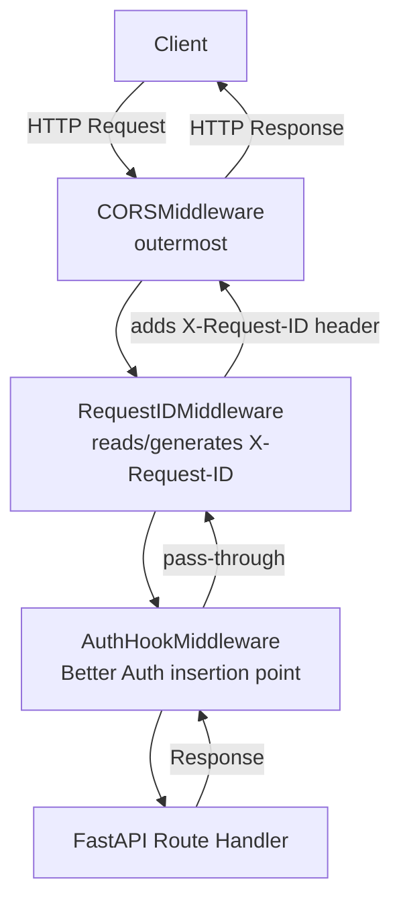

# Middleware Architecture

## Overview

The DevSphere ERP API uses a layered middleware pipeline built on Starlette's `BaseHTTPMiddleware`. All middleware is generic and reusable across every future ERP module.

## Pipeline Order

Request flows outermost → innermost:



Registration order in `create_app()` (LIFO — last added = outermost):

```python
app.add_middleware(AuthHookMiddleware)    # innermost
app.add_middleware(RequestIDMiddleware)  # middle
app.add_middleware(CORSMiddleware, ...)  # outermost
```

## Middleware Components

### CORSMiddleware

- **Source**: `fastapi.middleware.cors.CORSMiddleware`
- **Configuration**: `allow_origins=settings.CORS_ORIGINS`, `allow_credentials=True`, `allow_methods=["*"]`, `allow_headers=["*"]`, `expose_headers=["X-Request-ID"]`
- **Purpose**: Handles preflight requests and adds CORS response headers before any business logic runs.

### RequestIDMiddleware

- **Source**: `core.middleware.request_id.RequestIDMiddleware`
- **Reads**: `X-Request-ID` request header (uses it if present; generates a UUID v4 if absent)
- **Sets**: `REQUEST_ID_CONTEXT` (ContextVar) for the entire request lifecycle
- **Adds**: `X-Request-ID` header to every response
- **Resets**: Context variable token after response to prevent context bleed between requests

### AuthHookMiddleware

- **Source**: `core.middleware.auth_hook.AuthHookMiddleware`
- **Current behaviour**: Pass-through stub — calls `call_next(request)` without modification
- **Future role**: Better Auth integration point; validates session/token and populates `request.state` with identity

## Request Context

`REQUEST_ID_CONTEXT` is a `contextvars.ContextVar[str]` defined in `core.logging.setup`. It is:

- Set by `RequestIDMiddleware` at request start
- Read by the JSON structured logger to attach `request_id` to every log line
- Read by `ErrorResponse` handlers to populate the `X-Request-ID` response header
- Reset via `token.reset()` after the response to ensure isolation

## Future Better Auth Integration

When the Authentication Epic is implemented:

1. Replace `AuthHookMiddleware.dispatch` body with Better Auth session validation
2. On success: populate `request.state.user` (a `CurrentUser` instance)
3. On failure: raise `HTTP 401` for protected routes
4. Wire `get_current_user_stub` in `core.auth.interfaces` to read from `request.state.user`

**No changes to Repository Layer or Service Layer are required.**

## What is NOT in Middleware

The following concerns are intentionally excluded from middleware:

| Concern | Location |
|---|---|
| Rate limiting | Future: API Gateway / Phase N |
| Compression | Future: reverse proxy (nginx) |
| Caching | Future: Cache Layer |
| CSRF protection | N/A (API-only, token auth) |
| Business logic | Service Layer only |
| Authentication enforcement | `get_current_user_stub` dependency |
