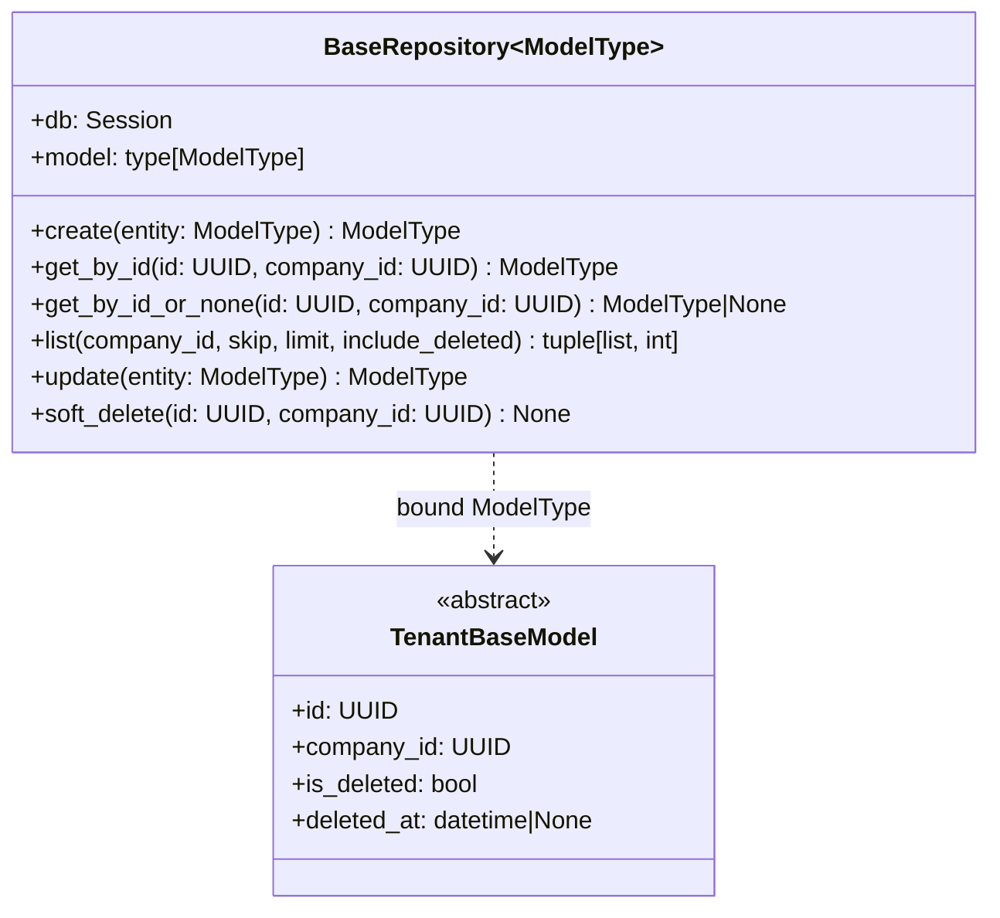

# Repository Pattern — DevSphere ERP

**Last Updated**: 2026-07-11 | **File**: `backend/core/repositories/base.py`

---

## Purpose

The Repository Pattern isolates all persistence logic (SQL queries, pagination, soft delete) from business rules. Services call repositories using domain language; repositories translate those calls into SQLAlchemy queries.

---

## Class Diagram



---

## Tenant Isolation Contract

Every method that reads or modifies data requires `company_id` as a mandatory parameter. The WHERE clause `company_id = <value>` is applied at the repository level — it is structurally impossible to omit it.

If a record exists but belongs to a different tenant, `get_by_id()` raises `NotFoundException` (not `ForbiddenException`) to avoid information disclosure.

---

## Soft Delete

| Field | Active State | Deleted State |
|-------|-------------|--------------|
| `is_deleted` | `False` | `True` |
| `deleted_at` | `NULL` | UTC timestamp |

`list()` excludes deleted records by default. Pass `include_deleted=True` for administrative views only.

`soft_delete()` calls `get_by_id()` internally — so it also enforces tenant isolation before deleting.

---

## Usage

```python
# Define a concrete repository (no code required if no custom queries needed)
class ProductRepository(BaseRepository[Product]):
    pass

# In a service:
repo = ProductRepository(db=db, model=Product)

# Create
product = Product(company_id=company_id, name="Widget")
saved = repo.create(product)

# Read (raises NotFoundException if cross-tenant or deleted)
product = repo.get_by_id(product_id, company_id=session.company_id)

# List with pagination
items, total = repo.list(company_id, skip=0, limit=20)

# Soft delete
repo.soft_delete(product_id, company_id=session.company_id)
```

---

## Adding Custom Queries

Extend `BaseRepository` and add methods alongside the inherited CRUD methods:

```python
class ProductRepository(BaseRepository[Product]):
    def find_by_sku(self, sku: str, company_id: UUID) -> Product | None:
        stmt = (
            select(Product)
            .where(Product.sku == sku)
            .where(Product.company_id == company_id)
            .where(Product.is_deleted == False)  # noqa: E712
        )
        return self.db.execute(stmt).scalars().one_or_none()
```
