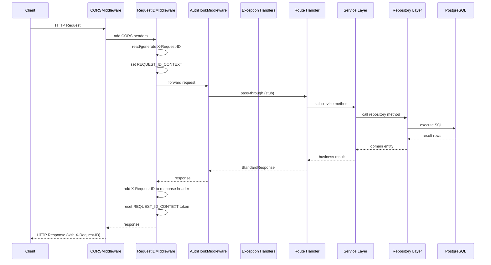
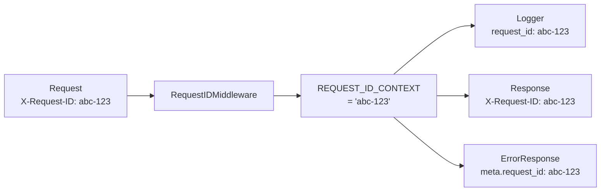
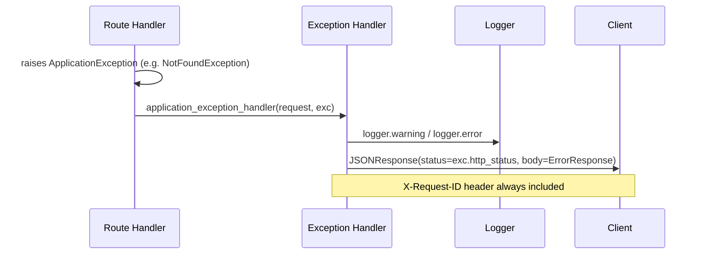

# Request Flow

## Complete Request Lifecycle



## Request ID Propagation



## Error Flow



## API Layer Structure

```
GET /                     → root() — API metadata
GET /api/v1/health        → health_check() — combined liveness + readiness
GET /api/v1/health/live   → liveness() — always 200 while process is running
GET /api/v1/health/ready  → readiness() — 200 when DB is reachable
```

## Router Registration

```
FastAPI app
└── GET /                         (main._register_routers)
└── _IncludedRouter /api/v1
    ├── GET /health               (api.v1.router)
    ├── GET /health/live          (api.v1.router)
    └── GET /health/ready         (api.v1.router)
```
