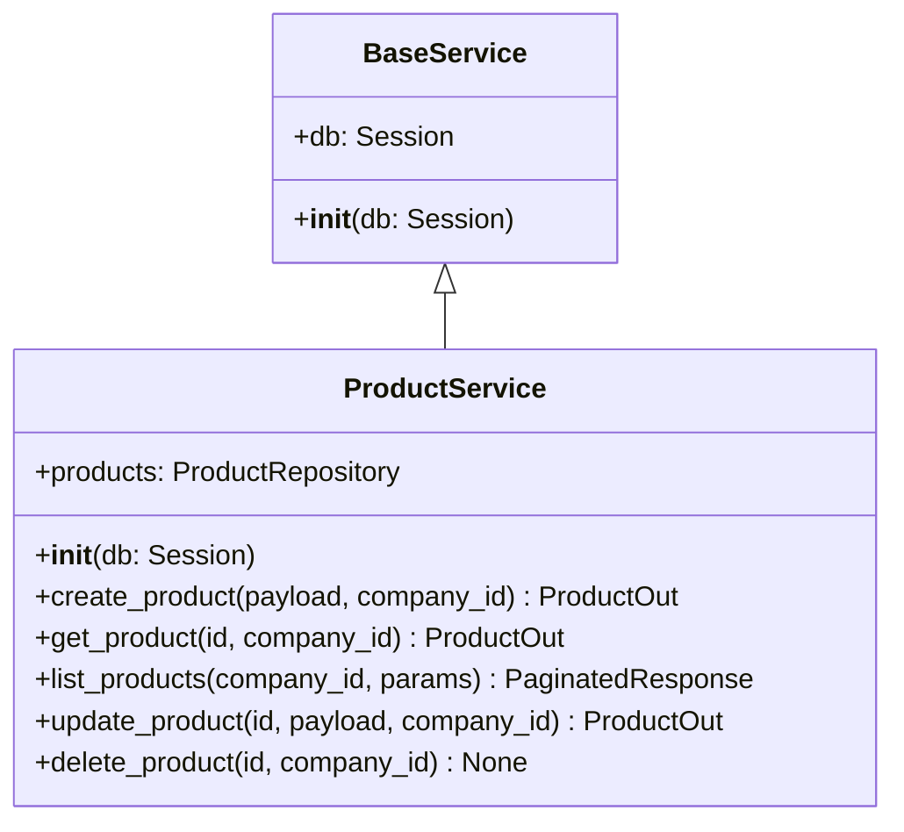

# Service Layer — DevSphere ERP

**Last Updated**: 2026-07-11 | **File**: `backend/core/services/base.py`

---

## Purpose

The Service Layer is the home of all business logic. Services:

- Receive Pydantic schemas from routers (not raw HTTP data)
- Call one or more repositories within a single `Session`
- Apply business rules and validation
- Return Pydantic schemas to routers (not ORM instances)

---

## Class Diagram



---

## Transaction Boundary

Each service method is one logical unit of work. The `Session` is injected by FastAPI's `get_db` dependency and shared across all repositories in the service. If an exception is raised, the session is NOT committed — the `finally: db.close()` in `get_db` ensures cleanup.

For multi-step operations that must be atomic, call `self.db.commit()` only once at the end:

```python
def transfer_stock(self, ...) -> None:
    self.warehouses.update(source)   # no commit yet
    self.warehouses.update(dest)     # no commit yet
    self.db.commit()                 # single atomic commit
```

---

## Dependency Injection Pattern

```python
from typing import Annotated
from fastapi import APIRouter, Depends
from sqlalchemy.orm import Session
from core.database.session import get_db
from modules.inventory.services.product_service import ProductService

router = APIRouter()

def get_product_service(db: Annotated[Session, Depends(get_db)]) -> ProductService:
    return ProductService(db=db)

@router.get("/products/{id}")
def get_product(
    id: UUID,
    service: Annotated[ProductService, Depends(get_product_service)],
    # company_id comes from authenticated session (Better Auth Epic)
) -> StandardResponse[ProductOut]:
    product = service.get_product(id=id, company_id=...)
    return StandardResponse(data=product, message="Product retrieved.", meta=...)
```

---

## Rules

| ✅ Services MUST | ❌ Services MUST NOT |
|-----------------|---------------------|
| Contain all business rules | Run SQL queries directly |
| Call repositories for data | Return ORM model instances |
| Validate business invariants | Handle HTTP concerns |
| Convert ORM → Pydantic schemas | Know about request/response |
| Raise `ApplicationException` subclasses | Catch and swallow exceptions silently |
