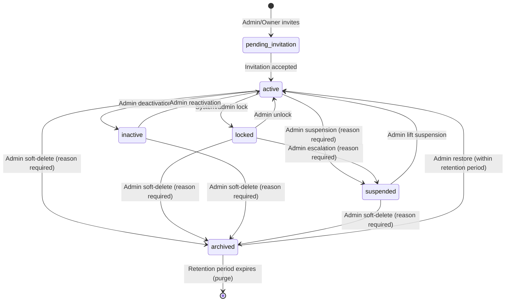
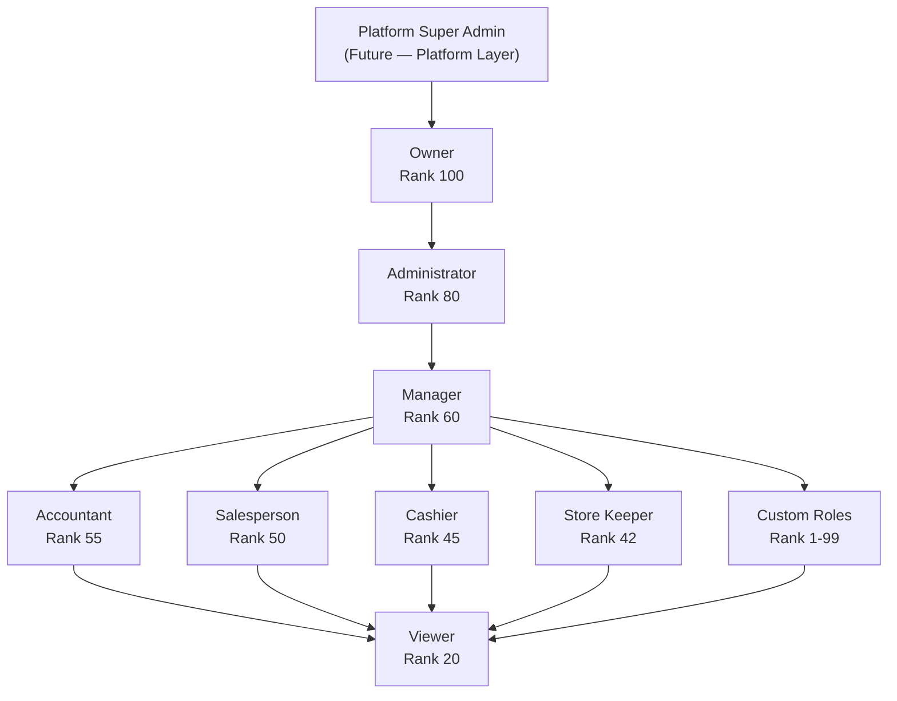
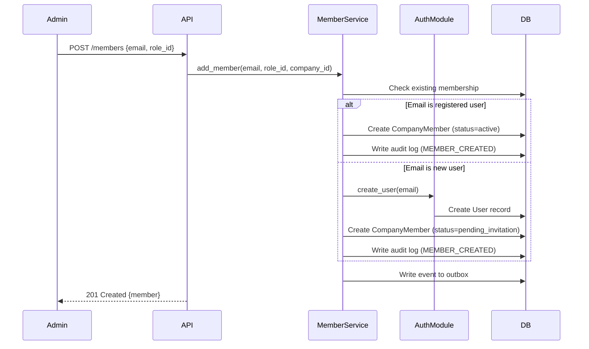
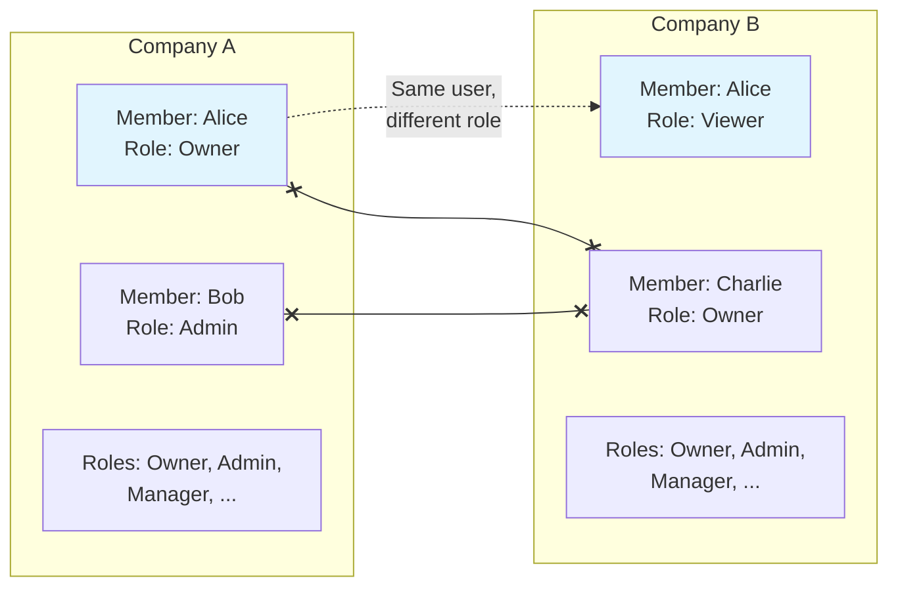
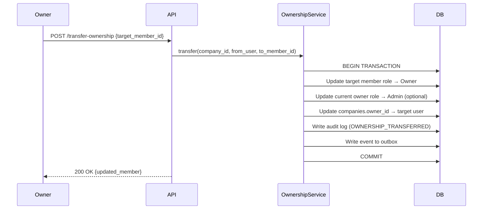

# Implementation Plan: Epic 4 — Users & Roles

**Branch**: `004-users-roles` | **Date**: 2026-07-16 | **Spec**: [spec.md](./spec.md)
**Status**: Draft — Ready for `/sp.tasks`
**Version**: 1.0.0

---

## Table of Contents

1. [Implementation Objectives](#1-implementation-objectives)
2. [Scope of Implementation](#2-scope-of-implementation)
3. [Technical Context](#3-technical-context)
4. [Constitution Check](#4-constitution-check)
5. [Architecture Alignment](#5-architecture-alignment)
6. [Domain Model](#6-domain-model)
7. [Bounded Context](#7-bounded-context)
8. [Layered Architecture](#8-layered-architecture)
9. [Backend Package Structure](#9-backend-package-structure)
10. [Frontend Architecture](#10-frontend-architecture)
11. [Frontend Folder Structure](#11-frontend-folder-structure)
12. [Authorization Strategy](#12-authorization-strategy)
13. [Identity Model](#13-identity-model)
14. [Invitation Architecture](#14-invitation-architecture)
15. [Session Management](#15-session-management)
16. [Audit Strategy](#16-audit-strategy)
17. [Validation Strategy](#17-validation-strategy)
18. [Error Handling Strategy](#18-error-handling-strategy)
19. [Security Architecture](#19-security-architecture)
20. [Performance Considerations](#20-performance-considerations)
21. [Extensibility](#21-extensibility)
22. [Testing Strategy](#22-testing-strategy)
23. [Risks](#23-risks)
24. [Implementation Phases](#24-implementation-phases)
25. [Definition of Done](#25-definition-of-done)
26. [Quality Gates](#26-quality-gates)
27. [Coding Standards Reference](#27-coding-standards-reference)
28. [Future Enhancements](#28-future-enhancements)
29. [Implementation Checklist](#29-implementation-checklist)
30. [Success Metrics](#30-success-metrics)
31. [Glossary](#31-glossary)
32. [Architectural Decisions (ADR Summary)](#32-architectural-decisions-adr-summary)
33. [Appendix](#33-appendix)

---

## 1. Implementation Objectives

Epic 4 transforms the single-owner company model established in Epic 3 into a fully collaborative, multi-user, role-based workspace. The technical goals are:

1. **Company Membership**: Implement the `CompanyMember` join entity that binds Users (Epic 2) to Companies (Epic 3) with independent role assignment, status, and employee information per membership.
2. **Role Management**: Implement the `Role` entity with 8 system-defined roles (Owner, Admin, Manager, Accountant, Salesperson, Cashier, Store Keeper, Viewer) seeded per company, plus custom role creation.
3. **Permission Registry**: Implement the `Permission` entity as a global catalogue and `RolePermission` join entity. Seed initial permissions for modules defined in Epics 1–4. Runtime evaluation is deferred.
4. **User Profile & Preferences**: Extend the User entity with avatar, phone, and implement the `UserPreference` entity for language, timezone, date format, and theme.
5. **Lifecycle Management**: Implement the membership state machine (pending_invitation → active → inactive/suspended/locked → archived) with session revocation on status change.
6. **Rank-Based Management**: Enforce that users can only manage members whose role rank is strictly lower than their own.
7. **Tenant Isolation**: Extend the company-scoped isolation patterns from Epic 3 to all membership, role, and permission queries.
8. **Audit Logging**: Record all 23 audited events (spec Section 10.1) in the `company_audit_logs` table established in Epic 3.
9. **Frontend**: Build 11 UI screens (member list, add/edit member, role management, profile, preferences, ownership transfer) following the Next.js App Router patterns from Epic 3.

---

## 2. Scope of Implementation

### 2.1 Included

| Area | Deliverables |
|------|-------------|
| **Database** | Alembic migration: `company_members`, `roles`, `permissions`, `role_permissions`, `user_preferences` tables. Extend `users` table with `avatar_url`, `avatar_previous_url`, `phone`. |
| **Backend Models** | SQLAlchemy models for all 5 new entities + User extension. |
| **Backend Repositories** | `CompanyMemberRepository`, `RoleRepository`, `PermissionRepository`, `UserPreferenceRepository`. |
| **Backend Services** | `MemberService`, `RoleService`, `PermissionService`, `ProfileService`, `OwnershipService`, `InvitationService`. |
| **Backend API** | REST endpoints under `/api/v1/companies/{company_id}/members`, `/api/v1/companies/{company_id}/roles`, `/api/v1/permissions`, `/api/v1/profile`, `/api/v1/preferences`. |
| **Backend Schemas** | Pydantic v2 request/response schemas for all CRUD operations. |
| **Frontend Pages** | Member list, add member, member details, edit member, role list, create role, edit role, role details, profile, preferences, ownership transfer. |
| **Seed Data** | 8 system roles with rank values. 14 initial permissions across 4 modules. Role-permission matrix. |
| **Tests** | Unit, integration, security, and performance test suites. |

### 2.2 Excluded

| Item | Reason |
|------|--------|
| Authentication (login, JWT, sessions) | Epic 2 — already implemented |
| Authorization middleware (runtime permission evaluation) | Future Epic |
| Fine-grained permission enforcement | Future Epic |
| SSO / SAML / OAuth | Future Epic |
| MFA enforcement | Future Epic |
| Invitation email delivery | Future capability (notification module) |
| Organisation chart / reporting hierarchy UI | Future Epic |
| Team / group management | Future Epic |
| Platform Super Admin implementation | Architecturally defined; implemented in future Epic |
| HR / Payroll / Attendance | Future Epics |

### 2.3 Dependencies

| Dependency | Relationship | Status |
|------------|-------------|--------|
| Epic 2 — Auth | `users` table, `get_current_user()` dependency, session revocation service, JWT middleware | Implemented |
| Epic 3 — Companies | `companies` table, `company_audit_logs` table, `owner_id` / `primary_admin_id` fields, S3 storage patterns, `get_current_company_member()` dependency pattern | Implemented |

### 2.4 Assumptions

- The existing `users` table (Epic 2) uses UUID primary keys and has `email`, `display_name`, `account_status` fields.
- The existing `company_audit_logs` table (Epic 3) accepts entries from any module via `action_code` discrimination.
- S3/MinIO storage patterns from Epic 3 (company logos) are reusable for avatar uploads.
- The `BaseRepository` in `core/repositories/base.py` provides common CRUD methods.
- The `AppException` hierarchy in `core/exceptions/base.py` supports module-specific exception classes.

### 2.5 Constraints

- No changes to Epic 2 or Epic 3 models beyond the documented extensions (User table additions, Company `owner_id` sync).
- Permission evaluation is structural only — no authorization middleware is implemented.
- Department remains a free-text field, not a separate entity.
- Single role per membership (no multi-role assignment).

---

## 3. Technical Context

| Dimension | Value |
|-----------|-------|
| **Backend Language** | Python 3.12+ |
| **Backend Framework** | FastAPI |
| **ORM** | SQLAlchemy 2.x (async) |
| **Migrations** | Alembic |
| **Schema Validation** | Pydantic v2 |
| **Frontend Language** | TypeScript 5.x (strict mode) |
| **Frontend Framework** | Next.js (App Router) |
| **UI Library** | shadcn/ui + Tailwind CSS |
| **Server State** | TanStack Query v5 |
| **Form Handling** | React Hook Form + Zod |
| **Database** | PostgreSQL 16 LTS |
| **Auth Integration** | JWT access tokens from Epic 2 (`core/auth/dependencies.py`) |
| **Testing (Backend)** | pytest + pytest-asyncio + httpx |
| **Testing (Frontend)** | Jest + React Testing Library |
| **Containerization** | Docker + Docker Compose |
| **File Storage** | S3-compatible (MinIO in dev; AWS S3 / R2 in production) |
| **Performance Targets** | Member listing p95 < 500ms (1000 members); Role listing p95 < 200ms; Member creation p95 < 1s |
| **Scale Target** | 10,000 members per company; 500 permissions; 50 custom roles per company |

---

## 4. Constitution Check

All gates reference the project Constitution at `.specify/memory/constitution.md`.

| Gate | Requirement | Status | Notes |
|------|-------------|--------|-------|
| Modular Monolith (§5) | Module lives under `backend/modules/users_roles/` | PASS | Mirrors `modules/companies/` pattern |
| Clean Architecture (§5.3) | API → Service → Repository → DB; no layer bypass | PASS | Enforced by design |
| Repository Pattern (§13) | All DB access through repositories | PASS | `CompanyMemberRepository`, `RoleRepository`, `PermissionRepository`, `UserPreferenceRepository` |
| Service Layer (§14) | All business logic in services | PASS | `MemberService`, `RoleService`, `ProfileService`, `OwnershipService`, `InvitationService` |
| Dependency Injection (§7) | `get_member_service()` FastAPI dependency | PASS | Consistent with Epic 3 pattern |
| DDD (§8) | Domain entities; domain events; bounded context | PASS | CompanyMember, Role, Permission as domain entities |
| Multi-Tenant Isolation (§9) | `company_id` on every business table; WHERE enforcement | PASS | CompanyMember, Role scoped by `company_id` |
| UUID Primary Keys (§17) | All entity IDs are UUID v4 | PASS | |
| Soft Delete (§17) | `deleted_at` + status field; no hard deletes via API | PASS | Archived status + `deleted_at` |
| Audit Trail (§35) | Every state change logged; immutable; who/what/when/before/after | PASS | 23 audited events; uses existing `company_audit_logs` |
| Error Handling (§21) | Centralized error envelope; module-specific exceptions | PASS | `UsersRolesException` hierarchy |
| Testing Standards (§31) | Unit + Integration test layers | PASS | |
| API Versioning (§32) | `/api/v1/` prefix | PASS | |
| No Secrets in Code (§19) | Avatar storage config via environment variables | PASS | |
| SaaS Readiness (§37) | Member count limits configurable | PASS | `COMPANY_MAX_MEMBERS` setting |
| Docker First (§27) | All services runnable via `docker compose up` | PASS | |
| Pydantic v2 (§6.2) | All schemas use Pydantic v2 syntax | PASS | |
| SQLAlchemy 2.x (§6.2) | Mapped column syntax; async session | PASS | |
| Event-Driven (§49) | Domain events for cross-module side effects | PASS | MemberCreated, RoleChanged, OwnershipTransferred events |
| Feature Toggles (§11) | Users & Roles is a core module — not toggle-gated | N/A | Core identity module; always enabled |

**Gate Result**: PASS — no violations. Implementation may proceed.

---

## 5. Architecture Alignment

### 5.1 Integration with Epic 2 (Authentication)

| Integration Point | Description |
|-------------------|-------------|
| **User entity extension** | Add `avatar_url`, `avatar_previous_url`, `phone` columns to the existing `users` table via Alembic migration. No changes to auth logic. |
| **`get_current_user()`** | Reuse the existing auth dependency to identify the authenticated user. Epic 4 builds `get_current_company_member()` on top. |
| **Session revocation** | When membership status changes (deactivate, suspend, lock, archive), the service calls Epic 2's session revocation to invalidate all tokens for that user+company. |
| **Account status independence** | Auth-level `account_status` (ACTIVE/INACTIVE/LOCKED/DELETED) is independent from membership status. Access requires BOTH active auth status AND active membership. |

### 5.2 Integration with Epic 3 (Companies)

| Integration Point | Description |
|-------------------|-------------|
| **Company entity** | `CompanyMember` and `Role` have FK to `companies.id`. Company creation auto-seeds 8 system roles. |
| **`owner_id` sync** | When ownership is transferred, `MemberService` updates `companies.owner_id` atomically. |
| **`primary_admin_id` sync** | When a primary admin is designated, `MemberService` updates `companies.primary_admin_id`. |
| **Audit logging** | Member and role events write to the same `company_audit_logs` table using new action codes. |
| **S3 storage** | Avatar uploads reuse the `core/storage/s3_client.py` established for company logos. |
| **Company status** | When a company is suspended/deleted, membership access checks honour company status without mutating membership records. |

### 5.3 Future Module Integration Pattern

Every future ERP module will integrate with Epic 4 through:

1. **Permission registration**: New module adds permissions to the registry via Alembic migration (e.g., `inventory.create`, `inventory.read`).
2. **Role-permission mapping**: Migration maps new permissions to system roles.
3. **Company context**: Module uses `get_current_company_member()` to get the active membership, role, and company.
4. **Authorization check** (future): Module's router uses a permission-checking dependency that evaluates the member's role permissions.

This pattern applies to: Inventory, Sales, Purchase, Accounting, CRM, Reports, Installments, AI, Notifications, Billing, API Keys, Mobile, Integrations, SSO, Branches, Warehouses, Document Management, Workflow Engine.

---

## 6. Domain Model

### 6.1 Core Entities

```
┌─────────────────────────────────────────────────────────────────┐
│                      DOMAIN MODEL                                │
│                                                                 │
│  User (Epic 2)          Company (Epic 3)                        │
│  ├── id                 ├── id                                  │
│  ├── email              ├── legal_name                          │
│  ├── display_name       ├── owner_id ──────────────────┐        │
│  ├── account_status     ├── primary_admin_id ──────┐   │        │
│  ├── avatar_url  [NEW]  └── status                 │   │        │
│  ├── avatar_previous_url [NEW]                     │   │        │
│  └── phone  [NEW]                                  │   │        │
│       │                                            │   │        │
│       │ 1:many                                     │   │        │
│       ↓                              1:many        │   │        │
│  CompanyMember [NEW]  ←────────── Company           │   │        │
│  ├── id                                            │   │        │
│  ├── company_id (FK)                               │   │        │
│  ├── user_id (FK)                                  │   │        │
│  ├── role_id (FK) ──→ Role                         │   │        │
│  ├── status                                        │   │        │
│  ├── employee_id                                   │   │        │
│  ├── job_title          Role [NEW]  ←──────────────┘   │        │
│  ├── department         ├── id                         │        │
│  ├── work_phone         ├── company_id (FK)            │        │
│  ├── hire_date          ├── name                       │        │
│  ├── notes              ├── slug        ←──────────────┘        │
│  ├── invited_by         ├── description                         │
│  ├── suspended_reason   ├── rank                                │
│  ├── deletion_reason    ├── is_system                           │
│  ├── deleted_at         ├── is_active                           │
│  ├── created_at         └── permissions → RolePermission        │
│  └── updated_at                                                 │
│                                                                 │
│  Permission [NEW]          RolePermission [NEW]                 │
│  ├── id                    ├── id                               │
│  ├── code                  ├── role_id (FK)                     │
│  ├── label                 └── permission_id (FK)               │
│  ├── module                                                     │
│  ├── action                UserPreference [NEW]                 │
│  └── description           ├── id                               │
│                            ├── user_id (FK, 1:1)                │
│                            ├── language                          │
│                            ├── timezone                          │
│                            ├── date_format                      │
│                            ├── number_format                    │
│                            ├── notification_preferences         │
│                            └── theme                            │
└─────────────────────────────────────────────────────────────────┘
```

### 6.2 Entity Relationships

| Relationship | Cardinality | Description |
|-------------|-------------|-------------|
| User → CompanyMember | 1:many | A user can be a member of multiple companies |
| Company → CompanyMember | 1:many | A company has many members |
| CompanyMember → Role | many:1 | Each member has exactly one role |
| Company → Role | 1:many | A company has its own set of roles |
| Role → RolePermission | 1:many | A role has many permission mappings |
| Permission → RolePermission | 1:many | A permission can be mapped to many roles |
| User → UserPreference | 1:1 | User-level display preferences |

### 6.3 Domain Events

| Event | Trigger | Payload |
|-------|---------|---------|
| `MemberCreatedEvent` | New member added to company | company_id, user_id, role_id, invited_by |
| `MemberRoleChangedEvent` | Member's role changed | company_id, user_id, old_role_id, new_role_id |
| `MemberDeactivatedEvent` | Member deactivated | company_id, user_id |
| `MemberSuspendedEvent` | Member suspended | company_id, user_id, reason |
| `MemberLockedEvent` | Member locked | company_id, user_id |
| `MemberArchivedEvent` | Member archived | company_id, user_id, reason |
| `MemberRestoredEvent` | Archived member restored | company_id, user_id |
| `OwnershipTransferredEvent` | Company ownership transferred | company_id, from_user_id, to_user_id |
| `RoleCreatedEvent` | Custom role created | company_id, role_id, role_name |
| `RoleUpdatedEvent` | Custom role updated | company_id, role_id |
| `RoleDeletedEvent` | Custom role deleted | company_id, role_id |
| `InvitationAcceptedEvent` | User accepts invitation | company_id, user_id |

Events are written to the `event_outbox` table (established in Epic 3) within the same transaction as the state change.

---

## 7. Bounded Context

### 7.1 Context Map

```
┌──────────────────────────────────────────────────────────────┐
│                  USERS & ROLES MODULE                         │
│                                                              │
│  ┌────────────────┐  ┌────────────────┐  ┌──────────────┐   │
│  │  Membership    │  │    Roles &     │  │   Profile &  │   │
│  │  Context       │  │  Permissions   │  │  Preferences │   │
│  │                │  │  Context       │  │  Context     │   │
│  │  • Add member  │  │  • System roles│  │  • Display   │   │
│  │  • Lifecycle   │  │  • Custom roles│  │    name      │   │
│  │  • Employee    │  │  • Permission  │  │  • Avatar    │   │
│  │    info        │  │    registry    │  │  • Phone     │   │
│  │  • Invitation  │  │  • Role-perm   │  │  • Language  │   │
│  │  • Search      │  │    mapping     │  │  • Timezone  │   │
│  └───────┬────────┘  └───────┬────────┘  │  • Theme     │   │
│          │                   │           └──────┬───────┘   │
│          └───────────┬───────┘                  │           │
│                      ↓                          │           │
│             ┌────────────────┐                  │           │
│             │ Audit Context  │←─────────────────┘           │
│             │  • Append-only │                              │
│             │  • Immutable   │                              │
│             │  • Company-    │                              │
│             │    scoped      │                              │
│             └────────────────┘                              │
└──────────────────────────────────────────────────────────────┘
         │                        │
         ↓                        ↓
┌────────────────┐      ┌────────────────┐
│  Auth Context  │      │ Company Context│
│  (Epic 2)      │      │  (Epic 3)      │
│  • User entity │      │  • Company     │
│  • Sessions    │      │  • owner_id    │
│  • JWT tokens  │      │  • Audit logs  │
└────────────────┘      │  • S3 storage  │
                        └────────────────┘
```

### 7.2 Context Responsibilities

| Context | Responsibilities | Boundaries |
|---------|-----------------|------------|
| **Membership** | CRUD on CompanyMember; lifecycle state machine; invitation workflow; member search/listing; employee info management | Does not manage authentication; does not evaluate permissions at runtime |
| **Roles & Permissions** | System role seeding; custom role CRUD; permission registry; role-permission mapping | Does not enforce permissions at runtime; does not modify auth tokens |
| **Profile & Preferences** | User avatar management; display name; phone; language/timezone/theme preferences | Owns User extensions only; does not modify auth fields (email, password) |
| **Audit** | Append-only event recording; before/after state capture | Write-only from this module; reads via company audit log endpoints (Epic 3) |
| **Invitation** (sub-context) | Invitation creation; expiry tracking; acceptance workflow; re-invitation logic | Does not send email (future notification module) |

---

## 8. Layered Architecture

The Users & Roles module enforces the same strict unidirectional dependency flow as Epic 3:

```
┌──────────────────────────────────────────────┐
│  API Layer (router.py)                        │
│  • HTTP request parsing                       │
│  • Pydantic schema validation                 │
│  • Authentication + role rank check           │
│  • Delegates to service; formats response     │
└──────────────────┬───────────────────────────┘
                   ↓
┌──────────────────────────────────────────────┐
│  Service Layer (services/)                    │
│  • All business rules and domain logic        │
│  • Orchestrates repositories                  │
│  • Publishes domain events via outbox         │
│  • Records audit log entries                  │
│  • Enforces state machine transitions         │
│  • Enforces rank-based management hierarchy   │
│  • No HTTP types; no SQLAlchemy types         │
└──────────────────┬───────────────────────────┘
                   ↓
┌──────────────────────────────────────────────┐
│  Repository Layer (repositories/)             │
│  • All database interaction via SQLAlchemy    │
│  • No business logic                          │
│  • Returns domain models or raises DataError  │
│  • Every query includes company_id            │
└──────────────────┬───────────────────────────┘
                   ↓
┌──────────────────────────────────────────────┐
│  Database (PostgreSQL via AsyncSession)        │
│  • company_members, roles, permissions        │
│  • role_permissions, user_preferences         │
│  • company_audit_logs (existing, Epic 3)      │
│  • event_outbox (existing, Epic 3)            │
└──────────────────────────────────────────────┘
```

**Layer Rules** (same as Epic 3):
- The router MUST NOT contain business logic. It validates input, calls the service, and returns a Pydantic schema.
- The service MUST NOT import SQLAlchemy types directly. It operates on domain model objects.
- The repository MUST NOT apply business rules. It executes queries and returns model instances.
- Cross-layer imports are prohibited. `router → service → repository` is the only permitted direction.

---

## 9. Backend Package Structure

```text
backend/
├── modules/
│   ├── auth/                              # Epic 2 (existing)
│   ├── companies/                         # Epic 3 (existing)
│   └── users_roles/                       # Epic 4 (NEW)
│       ├── __init__.py                    # Public interface exports
│       ├── router.py                      # FastAPI APIRouter; all endpoints
│       ├── dependencies.py                # DI factories; auth guards; role checks
│       ├── exceptions.py                  # UsersRolesException hierarchy
│       ├── validators.py                  # Pydantic field validators
│       ├── events.py                      # Domain event payload dataclasses
│       ├── constants.py                   # System role definitions, permission codes
│       ├── models/
│       │   ├── __init__.py
│       │   ├── company_member.py          # CompanyMember SQLAlchemy model
│       │   ├── role.py                    # Role SQLAlchemy model
│       │   ├── permission.py              # Permission SQLAlchemy model
│       │   ├── role_permission.py         # RolePermission join model
│       │   ├── user_preference.py         # UserPreference SQLAlchemy model
│       │   └── enums.py                   # MembershipStatus, PermissionAction enums
│       ├── repositories/
│       │   ├── __init__.py
│       │   ├── company_member_repository.py  # CRUD; company-scoped; status filters
│       │   ├── role_repository.py            # CRUD; system role seeding; company-scoped
│       │   ├── permission_repository.py      # Read-only; global registry
│       │   ├── role_permission_repository.py # Join table CRUD
│       │   └── user_preference_repository.py # 1:1 CRUD for user preferences
│       ├── services/
│       │   ├── __init__.py
│       │   ├── member_service.py          # Membership lifecycle; add/remove/status
│       │   ├── role_service.py            # Role CRUD; system role seeding
│       │   ├── permission_service.py      # Permission registry queries
│       │   ├── profile_service.py         # User profile & avatar management
│       │   ├── preference_service.py      # User preference CRUD
│       │   ├── ownership_service.py       # Ownership transfer logic
│       │   ├── invitation_service.py      # Invitation creation, acceptance, expiry
│       │   └── role_seed_service.py       # Seeds system roles + permissions for new company
│       └── schemas/
│           ├── __init__.py
│           ├── member.py                  # AddMemberRequest, MemberResponse, MemberListItem
│           ├── member_status.py           # DeactivateRequest, SuspendRequest, etc.
│           ├── role.py                    # CreateRoleRequest, RoleResponse, RoleDetailResponse
│           ├── permission.py              # PermissionResponse, PermissionGroupResponse
│           ├── profile.py                 # UpdateProfileRequest, ProfileResponse
│           ├── preference.py              # UpdatePreferenceRequest, PreferenceResponse
│           ├── ownership.py               # TransferOwnershipRequest
│           └── invitation.py              # InviteRequest, InvitationResponse
│
├── core/
│   ├── auth/                              # Existing — provides get_current_user()
│   ├── config/
│   │   └── settings.py                   # Add: COMPANY_MAX_MEMBERS, USER_AVATAR_MAX_BYTES,
│   │                                     #   AVATAR_RETENTION_DAYS, MEMBER_DELETION_RETENTION_DAYS,
│   │                                     #   MAX_CUSTOM_ROLES_PER_COMPANY, INVITATION_EXPIRY_DAYS
│   ├── database/
│   │   └── models/
│   │       └── base_model.py             # Existing BaseModel (id, created_at, updated_at)
│   ├── events/                            # Existing — event outbox infrastructure
│   ├── storage/                           # Existing — S3 client for avatar uploads
│   ├── exceptions/
│   │   └── base.py                       # Existing AppException base
│   └── repositories/
│       └── base.py                       # Existing BaseRepository
│
├── api/
│   └── v1/
│       └── router.py                     # Register users_roles router here
│
├── migrations/
│   └── versions/
│       └── 004_users_roles.py            # Alembic migration: Epic 4 tables
│
└── tests/
    ├── conftest.py                        # Shared fixtures (db, client, factory)
    ├── fixtures/
    │   ├── auth_fixtures.py               # Existing
    │   ├── company_fixtures.py            # Existing
    │   └── users_roles_fixtures.py        # NEW: Member, Role, Permission factories
    ├── unit/
    │   └── modules/
    │       └── users_roles/
    │           ├── __init__.py
    │           ├── test_member_service.py
    │           ├── test_role_service.py
    │           ├── test_permission_service.py
    │           ├── test_profile_service.py
    │           ├── test_ownership_service.py
    │           ├── test_invitation_service.py
    │           └── test_role_seed_service.py
    ├── integration/
    │   ├── repositories/
    │   │   └── users_roles/
    │   │       ├── __init__.py
    │   │       ├── test_company_member_repository.py
    │   │       ├── test_role_repository.py
    │   │       └── test_user_preference_repository.py
    │   └── api/
    │       └── v1/
    │           └── users_roles/
    │               ├── __init__.py
    │               ├── test_add_member.py
    │               ├── test_member_lifecycle.py
    │               ├── test_member_listing.py
    │               ├── test_role_management.py
    │               ├── test_permission_listing.py
    │               ├── test_profile.py
    │               ├── test_preferences.py
    │               ├── test_ownership_transfer.py
    │               └── test_invitation.py
    ├── security/
    │   └── users_roles/
    │       ├── test_tenant_isolation.py
    │       ├── test_rank_enforcement.py
    │       ├── test_owner_protection.py
    │       └── test_avatar_upload_security.py
    └── performance/
        └── users_roles/
            ├── test_member_list_performance.py
            └── test_role_list_performance.py
```

### Module Public Interface

```
backend/modules/users_roles/__init__.py
  → exports: MemberService, RoleService, get_current_company_member, require_role_rank
```

Other modules MUST NOT import from `modules/users_roles/repositories/`, `modules/users_roles/models/`, or `modules/users_roles/schemas/` directly.

### Dependency Injection Graph

```
AsyncSession  (core/database/session.py)
     ↓
CompanyMemberRepository
RoleRepository
PermissionRepository
RolePermissionRepository
UserPreferenceRepository
CompanyAuditLogRepository  (from modules/companies/)
EventOutboxRepository      (from core/events/)
S3Client                   (from core/storage/)
     ↓
MemberService(member_repo, role_repo, audit_repo, outbox_repo)
RoleService(role_repo, perm_repo, role_perm_repo, audit_repo, outbox_repo)
PermissionService(perm_repo)
ProfileService(user_repo, s3_client)
PreferenceService(pref_repo)
OwnershipService(member_repo, company_repo, audit_repo, outbox_repo)
InvitationService(member_repo, role_repo, audit_repo, outbox_repo)
RoleSeedService(role_repo, perm_repo, role_perm_repo)
     ↓
Router endpoints via get_member_service(), get_role_service(), etc.
```

---

## 10. Frontend Architecture

### 10.1 Page Architecture

The Users & Roles module adds pages under the existing `(protected)` route group, within the company context established by Epic 3.

| Route | Page | Purpose | Access |
|-------|------|---------|--------|
| `/companies/[id]/members` | MemberListPage | Paginated member table with search/filter | Admin+ |
| `/companies/[id]/members/add` | AddMemberPage | Add member form (email, role) | Admin+ |
| `/companies/[id]/members/[memberId]` | MemberDetailPage | Member profile, role, employee info | Admin+ (self-view for all) |
| `/companies/[id]/members/[memberId]/edit` | EditMemberPage | Edit role, employee info, status | Admin+ |
| `/companies/[id]/roles` | RoleListPage | All roles with member counts | Admin+ |
| `/companies/[id]/roles/new` | CreateRolePage | Custom role creation form | Owner/Admin |
| `/companies/[id]/roles/[roleId]` | RoleDetailPage | Role permissions and assigned members | Admin+ |
| `/companies/[id]/roles/[roleId]/edit` | EditRolePage | Edit custom role | Owner/Admin |
| `/profile` | MyProfilePage | Self-service profile edit | All authenticated |
| `/preferences` | MyPreferencesPage | Language, timezone, theme | All authenticated |
| `/companies/[id]/transfer-ownership` | OwnershipTransferPage | Ownership transfer confirmation | Owner only |

### 10.2 React Query Strategy

| Query Key | Endpoint | Stale Time |
|-----------|----------|-----------|
| `['members', companyId, filters]` | `GET /companies/{id}/members` | 2 minutes |
| `['member', companyId, memberId]` | `GET /companies/{id}/members/{memberId}` | 5 minutes |
| `['roles', companyId]` | `GET /companies/{id}/roles` | 5 minutes |
| `['role', companyId, roleId]` | `GET /companies/{id}/roles/{roleId}` | 5 minutes |
| `['permissions']` | `GET /permissions` | 30 minutes (rarely changes) |
| `['profile']` | `GET /profile` | 5 minutes |
| `['preferences']` | `GET /preferences` | 5 minutes |

**Mutation hooks**:
- `useAddMember(companyId)` → invalidates `['members', companyId]`
- `useUpdateMember(companyId, memberId)` → invalidates `['member']`, `['members']`
- `useChangeMemberStatus(companyId, memberId)` → invalidates `['member']`, `['members']`; optimistic status update
- `useCreateRole(companyId)` → invalidates `['roles', companyId]`
- `useUpdateRole(companyId, roleId)` → invalidates `['role']`, `['roles']`
- `useDeleteRole(companyId, roleId)` → invalidates `['roles']`
- `useUpdateProfile()` → invalidates `['profile']`
- `useUploadAvatar()` → invalidates `['profile']`
- `useUpdatePreferences()` → invalidates `['preferences']`
- `useTransferOwnership(companyId)` → invalidates `['members']`, `['member']`

### 10.3 Permission-Aware UI

Until the authorization engine is implemented (future Epic), the frontend uses a pragmatic approach:

1. **Role rank from context**: The `CompanyMemberContext` (provided by the company layout) includes the current user's role rank.
2. **UI visibility rules**: Components use rank-based checks to show/hide actions:
   - Rank ≥ 80 (Admin+): Show member management, role management actions
   - Rank ≥ 100 (Owner): Show ownership transfer, company delete
   - Any rank: Show own profile and preferences
3. **Guard components**: `<RequireRank rank={80}>` wrapper hides UI elements for insufficient rank.
4. **Server authority**: All permission checks are authoritative on the backend. Frontend checks are UX-only — they hide buttons but don't enforce security.

### 10.4 Forms

All forms use React Hook Form + Zod schemas mirroring backend Pydantic schemas:

- `AddMemberForm` — email, role selector, optional employee info (job title, department, employee ID)
- `EditMemberForm` — role change, employee info update
- `MemberStatusForm` — status action with mandatory reason (suspend/archive)
- `CreateRoleForm` — name, description, rank slider, permission checklist (grouped by module)
- `EditRoleForm` — same as create, with immutable system role guard
- `ProfileForm` — display name, phone, avatar upload with preview
- `PreferencesForm` — language selector, timezone selector, date format, theme toggle
- `OwnershipTransferForm` — target member selector with explicit confirmation

### 10.5 State Management

- **Server state**: TanStack Query for all API data (members, roles, permissions, profile)
- **Company context**: `CompanyMemberContext` extends `CompanyContext` (Epic 3) with current member's role and rank
- **Form state**: React Hook Form local state; no global form state
- **UI state**: Component-local `useState` for modals, filters, sort order

---

## 11. Frontend Folder Structure

```text
frontend/src/
├── app/
│   ├── (protected)/
│   │   ├── layout.tsx                      # Existing auth guard
│   │   ├── (companies)/
│   │   │   ├── companies/
│   │   │   │   └── [id]/
│   │   │   │       ├── members/            # NEW
│   │   │   │       │   ├── page.tsx        # MemberListPage
│   │   │   │       │   ├── add/
│   │   │   │       │   │   └── page.tsx    # AddMemberPage
│   │   │   │       │   └── [memberId]/
│   │   │   │       │       ├── page.tsx    # MemberDetailPage
│   │   │   │       │       └── edit/
│   │   │   │       │           └── page.tsx # EditMemberPage
│   │   │   │       ├── roles/              # NEW
│   │   │   │       │   ├── page.tsx        # RoleListPage
│   │   │   │       │   ├── new/
│   │   │   │       │   │   └── page.tsx    # CreateRolePage
│   │   │   │       │   └── [roleId]/
│   │   │   │       │       ├── page.tsx    # RoleDetailPage
│   │   │   │       │       └── edit/
│   │   │   │       │           └── page.tsx # EditRolePage
│   │   │   │       └── transfer-ownership/ # NEW
│   │   │   │           └── page.tsx        # OwnershipTransferPage
│   │   ├── profile/                        # NEW (outside company scope)
│   │   │   └── page.tsx                    # MyProfilePage
│   │   └── preferences/                    # NEW (outside company scope)
│   │       └── page.tsx                    # MyPreferencesPage
│
├── components/
│   └── users-roles/                        # NEW
│       ├── MemberTable.tsx                 # Paginated table with filters
│       ├── MemberStatusBadge.tsx           # Status pill (active/inactive/suspended/locked)
│       ├── MemberCard.tsx                  # Member summary card
│       ├── AddMemberForm.tsx               # Email + role + employee info
│       ├── EditMemberForm.tsx              # Role + employee info edit
│       ├── MemberStatusActions.tsx         # Deactivate/suspend/lock/archive buttons
│       ├── RoleTable.tsx                   # Role list with member counts
│       ├── RoleForm.tsx                    # Create/edit role form
│       ├── RolePermissionChecklist.tsx     # Grouped permission checkboxes
│       ├── RoleBadge.tsx                   # Role name + rank display
│       ├── ProfileForm.tsx                 # Display name, phone, avatar
│       ├── AvatarUpload.tsx               # Drag-and-drop avatar with preview
│       ├── PreferencesForm.tsx            # Language, timezone, date format, theme
│       ├── OwnershipTransferDialog.tsx    # Transfer confirmation dialog
│       ├── RequireRank.tsx                # Permission guard wrapper component
│       └── CompanyMemberProvider.tsx       # Extends CompanyContext with member info
│
├── hooks/
│   └── users-roles/                        # NEW
│       ├── useMembers.ts                  # List members query + mutations
│       ├── useMember.ts                   # Single member query
│       ├── useRoles.ts                    # Roles query + mutations
│       ├── useRole.ts                     # Single role query
│       ├── usePermissions.ts              # Permissions registry query
│       ├── useProfile.ts                  # Profile query + mutation
│       ├── usePreferences.ts              # Preferences query + mutation
│       ├── useCurrentMember.ts            # Current user's membership context
│       └── useOwnershipTransfer.ts        # Transfer mutation
│
├── lib/
│   └── api/
│       └── users-roles.ts                 # NEW: API client functions
│
└── schemas/
    └── users-roles.ts                     # NEW: Zod validation schemas
```

---

## 12. Authorization Strategy

### 12.1 Current Scope (Epic 4)

Epic 4 implements the **structural foundation** for authorization but does NOT implement runtime enforcement middleware:

| Component | Epic 4 | Future Epic |
|-----------|--------|-------------|
| Role entity with rank hierarchy | ✓ Implemented | — |
| Permission registry (catalogue) | ✓ Implemented | — |
| Role-permission mapping | ✓ Implemented | — |
| Rank-based management check | ✓ Implemented (in service layer) | — |
| Authorization middleware | — | Runtime evaluation of permissions against endpoints |
| ABAC policy engine | — | Attribute-based access control |
| Field-level permissions | — | Column-level visibility |
| Record-level permissions | — | Row-level security |

### 12.2 Rank-Based Management (Implemented)

The service layer enforces rank-based management hierarchy:

1. Before any member management operation (role change, status change), the service checks: `actor.role.rank > target.role.rank`.
2. If the check fails, the service raises `InsufficientRankError`.
3. A member cannot modify their own role.
4. The last Owner of a company cannot be deactivated, suspended, or demoted.

### 12.3 Permission Evaluation (Future)

The permission model is designed for future evaluation. When the Authorization Engine Epic is implemented:

1. Router dependencies will check: `require_permission('members.create')`.
2. The middleware will load the member's role, look up the role's permissions, and evaluate whether the required permission is granted.
3. The permission registry is extensible — new modules add permissions via migration.

---

## 13. Identity Model

### 13.1 Two-Layer Identity Architecture

```
Platform Layer (Future)                    Company Layer (Epic 4)
┌─────────────────────────┐               ┌─────────────────────────────┐
│ Platform Super Admin    │               │ User (login identity)       │
│ Platform Support        │               │   ↓                         │
│ Platform Auditor        │               │ CompanyMember (per-company) │
│ Platform Operations     │               │   ↓                         │
│                         │               │ Role (assigned per member)  │
│ NOT in company_members  │               │   ↓                         │
│ Separate identity scope │               │ Permission (via role)       │
└─────────────────────────┘               └─────────────────────────────┘
```

### 13.2 Multi-Company Membership

A single User may hold memberships in multiple companies. Each membership is fully independent:

- **Independent role**: User may be Owner in Company A and Viewer in Company B.
- **Independent status**: User may be active in Company A and suspended in Company B.
- **Independent employee info**: Different job title, department, employee ID per company.
- **Single active context**: Only one company context is active per session. Switching company changes all authorization scope.

### 13.3 Tenant Isolation Enforcement

Every repository method in this module includes `company_id` in the WHERE clause:

- `CompanyMemberRepository`: All queries filter by `company_id`.
- `RoleRepository`: All queries filter by `company_id`.
- `RolePermissionRepository`: Joins through `Role` which is company-scoped.
- `PermissionRepository`: Global (not company-scoped) — read-only catalogue.
- `UserPreferenceRepository`: User-scoped (not company-scoped) — preferences are personal.

---

## 14. Invitation Architecture

### 14.1 Invitation Workflow

```
Admin/Owner calls "Add Member"
         ↓
┌─ Email already registered as user? ─┐
│                                      │
│  YES                            NO   │
│  ↓                              ↓    │
│  Create CompanyMember           Create User account       │
│  with status=active             (via Auth module)         │
│  (user already has account)     + Create CompanyMember    │
│                                 with status=              │
│                                 pending_invitation        │
│                                      ↓                   │
│                                 (Future: send invite     │
│                                  email via notification   │
│                                  module)                  │
│                                      ↓                   │
│                                 User accepts invitation   │
│                                 (sets password via Auth)  │
│                                      ↓                   │
│                                 Status → active           │
└──────────────┬───────────────────────┘
               ↓
         Audit log: MEMBER_CREATED
         Domain event: MemberCreatedEvent
```

### 14.2 Invitation Rules

| Rule | Description |
|------|-------------|
| **Expiry** | Pending invitations expire after `INVITATION_EXPIRY_DAYS` (default: 7). Expired invitations remain in `pending_invitation` status but are not actionable. |
| **Re-invitation** | An Admin/Owner can re-invite an expired invitation, resetting the expiry window. |
| **Duplicate prevention** | A user can have at most one non-archived membership per company (BR-030). |
| **Archived reactivation** | If the invited email has an archived membership in the same company, the system reactivates the existing record rather than creating a duplicate (BR-044). |
| **Existing user** | If the email belongs to an already-registered user, no new user account is created — only a new CompanyMember record. |

---

## 15. Session Management

### 15.1 Current Scope

Session management is primarily handled by Epic 2 (Auth). Epic 4's session-related responsibilities:

| Responsibility | Implementation |
|---------------|----------------|
| **Session revocation on status change** | When a member is deactivated, suspended, locked, or archived, `MemberService` calls the Auth module's session revocation service to invalidate all tokens for that user in that company. |
| **Company context switching** | When a user switches active company, the frontend updates `CompanyMemberContext` and the backend validates the new company membership on each subsequent request. |
| **Forced logout** | Admins can change a member's status (→ deactivate/suspend), which triggers session revocation — effectively a forced logout. |

### 15.2 Future Concepts (Documented, Not Implemented)

Trusted devices, remember-me, concurrent session management, device tracking, and MFA compatibility are architecturally planned (spec Section 19) but not implemented in this Epic.

---

## 16. Audit Strategy

### 16.1 Audit Events

All 23 events from spec Section 10.1 are recorded in the existing `company_audit_logs` table. Each audit entry includes:

| Field | Source |
|-------|--------|
| `company_id` | Active company context |
| `actor_user_id` | Authenticated user (from JWT) |
| `action_code` | Event-specific constant (e.g., `MEMBER_CREATED`) |
| `entity_type` | `company_member`, `role`, `profile`, `preference` |
| `entity_id` | UUID of affected entity |
| `before_state` | JSONB snapshot before change (for updates) |
| `after_state` | JSONB snapshot after change |
| `ip_address` | From request headers |
| `user_agent` | From request headers |
| `request_id` | From middleware |
| `timestamp` | Server UTC timestamp |

### 16.2 Audit Write Pattern

Audit entries are written within the same database transaction as the state change (same as Epic 3). This guarantees consistency — no audit entry exists without a corresponding state change, and vice versa.

The `MemberService`, `RoleService`, `ProfileService`, and `OwnershipService` all accept an `audit_service` dependency and call it after each state mutation.

---

## 17. Validation Strategy

### 17.1 Two-Stage Validation

Identical pattern to Epic 3:

1. **Schema validation (Pydantic v2)**: Field types, formats, length constraints. Executed automatically by FastAPI before the router handler is called.
2. **Business validation (Service layer)**: Uniqueness checks, status transition validity, rank enforcement, ownership protection. Executed within service methods.

### 17.2 Validation Categories

| Category | Layer | Examples |
|----------|-------|---------|
| **Input validation** | Pydantic schemas | Email format, string lengths, enum values, date validity |
| **Business validation** | Service | Duplicate membership, invalid status transition, rank hierarchy violation |
| **Permission validation** | Service | Actor rank ≥ target rank, Owner-only operations |
| **Ownership validation** | Service | Cannot remove last Owner, cannot demote last Owner |
| **Company isolation** | Repository | Every query includes `company_id` |
| **Referential integrity** | Database | FK constraints, unique constraints |

---

## 18. Error Handling Strategy

### 18.1 Exception Hierarchy

```
AppException (core/exceptions/base.py)
  └── UsersRolesException
        ├── MemberNotFoundError              → 404
        ├── MemberAlreadyExistsError         → 409
        ├── MemberLimitExceededError          → 409
        ├── InvalidStatusTransitionError      → 409
        ├── InsufficientRankError             → 403
        ├── LastOwnerProtectionError          → 409
        ├── CannotModifyOwnRoleError          → 409
        ├── RoleNotFoundError                → 404
        ├── RoleNameConflictError             → 409
        ├── RoleHasActiveAssignmentsError     → 409
        ├── SystemRoleImmutableError          → 403
        ├── CustomRoleLimitExceededError      → 409
        ├── InvalidRoleRankError              → 422
        ├── EmployeeIdConflictError           → 409
        ├── InvitationExpiredError            → 410
        ├── AvatarTooLargeError              → 400
        ├── AvatarInvalidFormatError          → 400
        └── AvatarInvalidContentError         → 400
```

### 18.2 Error Response Format

All errors follow the existing standard envelope (Constitution §21):

```json
{
  "error": {
    "code": "MEMBER_ALREADY_EXISTS",
    "message": "A membership already exists for this user in this company.",
    "details": {}
  }
}
```

---

## 19. Security Architecture

### 19.1 Principles Applied

| Principle | How Applied |
|-----------|-------------|
| **Least Privilege** | System roles have minimal permission sets. Custom roles compose only needed permissions. New members default to lowest rank. |
| **Default Deny** | Without an explicit permission grant, actions are denied. Permission model is opt-in. |
| **Company Isolation** | Every query includes `company_id`. Cross-company access is impossible via standard API endpoints. |
| **Immutable Audit** | Audit entries are append-only. No update or delete methods exist on the audit repository. |
| **Defence in Depth** | Auth-level status + membership status + role rank + company context = 4 layers of access control. |
| **Secure by Default** | Avatar URLs use pre-signed URLs (no direct S3 access). Admin notes not visible to low-rank members. Session revocation is immediate on status change. |
| **Zero Trust Readiness** | Every request validates company membership independently. No cached trust between requests. |
| **Rank hierarchy** | A user can never elevate another user to their own rank or higher. Self-role-change is prohibited. |

### 19.2 Data Protection

- Avatar uploads validate MIME type by magic bytes (same as company logo pattern).
- Admin notes (`CompanyMember.notes`) are excluded from responses for members with rank < 80.
- Password and credential data remain exclusively in the Auth module — this module never accesses credential fields.
- Employee IDs, phone numbers, and hire dates are considered internal data and are accessible only by Admin+ members.

---

## 20. Performance Considerations

### 20.1 Database Indexes (Conceptual)

| Index | Purpose |
|-------|---------|
| `company_members(company_id, user_id)` | Fast membership lookup and uniqueness enforcement |
| `company_members(company_id, status)` | Status-filtered member listings |
| `company_members(company_id, role_id)` | Role-based member counts |
| `company_members(company_id, department)` | Department-filtered listings |
| `roles(company_id, name)` | Role name uniqueness and lookup |
| `roles(company_id, is_system)` | System role queries |
| `permissions(code)` | Permission lookup by code |
| `role_permissions(role_id, permission_id)` | Role-permission mapping lookups |
| `user_preferences(user_id)` | 1:1 preference lookup |

### 20.2 Pagination

All list endpoints follow the existing pagination pattern from Epic 3:
- Default page size: 25
- Maximum page size: 100
- Response includes: `total_count`, `page`, `page_size`, `total_pages`
- Cursor-based pagination may be introduced in future if offset pagination degrades at scale.

### 20.3 Caching Readiness

No caching is implemented in Epic 4 (per Constitution §25 — avoid premature optimization). The architecture is cache-ready:

- **Permission lookups**: The role-permission matrix changes infrequently. Future Redis cache with invalidation on role-permission mutation.
- **Member count per role**: Can be cached and invalidated on membership changes.
- **System role IDs**: Static per company — cacheable at application startup.

### 20.4 Query Optimization

- Member listing with 1000+ members uses database-level pagination (LIMIT/OFFSET), not in-memory.
- Text search on `display_name` and `email` uses case-insensitive LIKE with appropriate indexes.
- Role listing with member counts uses a single aggregated query (COUNT + GROUP BY), not N+1.
- Permission registry is loaded once and can be served from memory for the lifetime of the process.

---

## 21. Extensibility

### 21.1 Permission Extension Pattern

When a future module (e.g., Inventory) is implemented:

1. **Alembic migration** adds new permissions to the `permissions` table:
   ```
   inventory.create, inventory.read, inventory.update, inventory.delete, inventory.export
   ```
2. **Same migration** maps permissions to system roles via `role_permissions`:
   - Store Keeper gets: `inventory.create`, `inventory.read`, `inventory.update`
   - Manager gets: `inventory.read`, `inventory.update`
   - Admin/Owner get: all inventory permissions
3. **No code changes** to the Users & Roles module are required.

### 21.2 Module Integration Points

| Future Module | Integration with Epic 4 |
|--------------|------------------------|
| **Inventory** | Adds `inventory.*` permissions; Store Keeper role gets default access |
| **Sales** | Adds `sales.*` permissions; Salesperson role gets default access |
| **Purchase** | Adds `purchase.*` permissions; mapped to Manager+ |
| **Accounting** | Adds `accounting.*` permissions; Accountant role gets default access |
| **CRM** | Adds `crm.*` permissions; Salesperson and Manager get access |
| **Reports** | Adds `reports.read`, `reports.export`; mapped by role |
| **Notifications** | Uses membership data to determine notification targets |
| **Billing** | Uses member count for subscription tier enforcement |
| **API Keys** | Associates API keys with users and permission scopes |
| **Mobile App** | Same API, same roles, same permissions |
| **SSO** | Maps external identity to CompanyMember records |
| **Branches** | Adds `branch_id` scope alongside `company_id` |
| **Workflow Engine** | Uses role hierarchy for approval chain routing |

---

## 22. Testing Strategy

### 22.1 Test Layers

| Layer | Count (est.) | Focus |
|-------|-------------|-------|
| **Unit** | ~60 tests | Service logic: lifecycle transitions, rank enforcement, ownership protection, role seeding, invitation rules |
| **Integration (Repository)** | ~25 tests | CRUD operations, uniqueness constraints, company isolation |
| **Integration (API)** | ~50 tests | End-to-end request/response, auth headers, error codes, pagination |
| **Security** | ~20 tests | Tenant isolation, rank bypass attempts, owner protection, avatar security |
| **Performance** | ~5 tests | Member listing latency, role listing latency |

### 22.2 Critical Test Scenarios

| Scenario | Layer | Assertion |
|----------|-------|-----------|
| Last Owner cannot be demoted | Unit + Integration | Returns `LastOwnerProtectionError` |
| Cross-company member access | Security | Returns 404 (not 403 — no information leakage) |
| Lower-rank user cannot manage higher-rank | Unit | Returns `InsufficientRankError` |
| Member cannot change own role | Unit | Returns `CannotModifyOwnRoleError` |
| Archived member reactivation on re-invite | Unit | Existing archived membership is reactivated |
| System role modification attempt | Unit | Returns `SystemRoleImmutableError` |
| Status transition: active → locked → archived | Unit | Valid transition; sessions revoked at each step |
| Invalid status transition: archived → suspended | Unit | Returns `InvalidStatusTransitionError` |
| Member listing with 1000 members | Performance | p95 < 500ms |
| System roles seeded on company creation | Integration | 8 system roles exist with correct ranks |

### 22.3 Test Fixtures

`tests/fixtures/users_roles_fixtures.py` provides:

- `create_test_member(company, user, role, status)` — factory for CompanyMember
- `create_test_role(company, name, rank, is_system)` — factory for Role
- `create_test_permission(code, module, action)` — factory for Permission
- `seed_system_roles(company)` — seeds all 8 system roles with permissions
- `create_member_with_role(company, role_name)` — convenience: creates user + member + role

---

## 23. Risks

| # | Risk | Severity | Probability | Mitigation |
|---|------|----------|-------------|------------|
| 1 | **Schema migration breaks existing data** | HIGH | LOW | Test migration on production data clone; include rollback in migration |
| 2 | **Role seeding race condition on concurrent company creation** | MEDIUM | LOW | Use database-level unique constraints; idempotent seed function |
| 3 | **Performance degradation with large member lists** | MEDIUM | MEDIUM | Database indexes on `company_id` + `status`; pagination enforced |
| 4 | **Ownership transfer partial failure** | HIGH | LOW | Atomic transaction: role change + `owner_id` update in single commit |
| 5 | **Cross-company data leakage** | CRITICAL | LOW | Every repository method includes `company_id`; security test suite |
| 6 | **Session revocation delay on status change** | MEDIUM | LOW | Synchronous revocation call within the same service method |
| 7 | **Avatar upload abuse** | LOW | MEDIUM | MIME validation by magic bytes; file size limit; rate limiting |
| 8 | **Orphaned permissions after module removal** | LOW | LOW | Permissions are additive-only; no removal mechanism |
| 9 | **Rank collision between custom and system roles** | MEDIUM | LOW | Database constraint preventing custom role ranks from equalling system role ranks |

---

## 24. Implementation Phases

### Phase 1: Foundation — Database & Models

**Objective**: Establish the data layer for all Epic 4 entities.

**Deliverables**:
- Alembic migration creating all 5 tables + User extension columns
- SQLAlchemy models for CompanyMember, Role, Permission, RolePermission, UserPreference
- Enum definitions (MembershipStatus, PermissionAction)
- Constants file with system role definitions and initial permission codes
- Configuration settings added to `core/config/settings.py`

**Completion Criteria**: Migration runs successfully; models pass type checking; seeds can be loaded.

### Phase 2: Repositories & Core Services

**Objective**: Implement data access and core business logic.

**Deliverables**:
- All 5 repository classes with company-scoped queries
- `RoleSeedService` — seeds system roles and permissions for a new company
- `MemberService` — membership CRUD, lifecycle state machine, rank enforcement
- `RoleService` — role CRUD, system role immutability, custom role limits
- `PermissionService` — permission registry queries
- `InvitationService` — invitation creation, acceptance, re-invitation
- `OwnershipService` — ownership transfer with company.owner_id sync
- Module-specific exception classes
- Domain event definitions

**Dependencies**: Phase 1

**Completion Criteria**: All unit tests pass; services enforce all business rules from spec.

### Phase 3: Profile, Preferences & Avatar

**Objective**: Implement user profile management and avatar upload.

**Deliverables**:
- `ProfileService` — display name, phone, avatar upload/delete
- `PreferenceService` — CRUD for user preferences
- `UserPreferenceRepository`
- Avatar upload using existing S3 patterns from Epic 3

**Dependencies**: Phase 1

**Completion Criteria**: Profile and preferences CRUD works; avatar upload/delete works; previous avatar retention works.

### Phase 4: API Layer

**Objective**: Expose all functionality via REST endpoints.

**Deliverables**:
- Pydantic v2 request/response schemas for all operations
- Router with all endpoints under company and profile paths
- FastAPI dependencies: `get_member_service()`, `get_role_service()`, etc.
- Role rank checking dependencies
- Validators for custom fields
- Rate limiting on member creation

**Dependencies**: Phase 2, Phase 3

**Completion Criteria**: All API integration tests pass; error responses match spec.

### Phase 5: Company Integration & Role Seeding

**Objective**: Integrate with Epic 3 — auto-seed roles on company creation, sync owner_id.

**Deliverables**:
- Hook into company creation flow to trigger role seeding
- Ownership transfer syncs `companies.owner_id`
- Primary admin designation syncs `companies.primary_admin_id`
- Company status affects membership access checks

**Dependencies**: Phase 2, Phase 4

**Completion Criteria**: New company has 8 system roles; ownership transfer updates company record; suspended company blocks member access.

### Phase 6: Audit & Events

**Objective**: Record all 23 audited events and publish domain events.

**Deliverables**:
- Audit log writes for all 23 events with before/after state
- Domain events written to outbox for all state changes
- Audit entries include IP, user agent, request ID

**Dependencies**: Phase 2

**Completion Criteria**: Every state change produces an audit entry; events appear in outbox.

### Phase 7: Frontend — Member Management

**Objective**: Build member management UI screens.

**Deliverables**:
- MemberListPage with search, filters, pagination
- AddMemberPage with form validation
- MemberDetailPage with role, employee info, status display
- EditMemberPage with status actions (deactivate, suspend, archive)
- CompanyMemberProvider extending company context with member info
- RequireRank guard component
- React Query hooks for member operations

**Dependencies**: Phase 4

**Completion Criteria**: Members can be added, listed, searched, filtered, edited, and status-changed via UI.

### Phase 8: Frontend — Role & Permission Management

**Objective**: Build role management UI screens.

**Deliverables**:
- RoleListPage with member counts
- CreateRolePage with permission checklist
- EditRolePage for custom roles (system roles read-only)
- RoleDetailPage showing permissions and assigned members
- React Query hooks for role operations

**Dependencies**: Phase 4, Phase 7

**Completion Criteria**: Roles can be listed, created, edited, deactivated, deleted via UI.

### Phase 9: Frontend — Profile & Preferences

**Objective**: Build self-service profile and preferences screens.

**Deliverables**:
- MyProfilePage with avatar upload, display name, phone
- MyPreferencesPage with language, timezone, date format, theme
- AvatarUpload component with drag-and-drop and preview
- React Query hooks for profile and preferences

**Dependencies**: Phase 4

**Completion Criteria**: Users can update their own profile and preferences via UI.

### Phase 10: Frontend — Ownership Transfer

**Objective**: Implement ownership transfer flow.

**Deliverables**:
- OwnershipTransferPage with confirmation dialog
- Member selector for transfer target
- React Query mutation hook

**Dependencies**: Phase 7

**Completion Criteria**: Owner can transfer ownership to another active member via UI.

### Phase 11: Security & Performance Testing

**Objective**: Validate security properties and performance targets.

**Deliverables**:
- Tenant isolation test suite
- Rank enforcement test suite
- Owner protection test suite
- Avatar upload security tests
- Member listing performance tests (1000 members < 500ms p95)
- Role listing performance tests

**Dependencies**: Phase 4, Phase 5, Phase 6

**Completion Criteria**: All security tests pass; performance targets met.

### Phase 12: Polish & Documentation

**Objective**: Final integration, documentation, and cleanup.

**Deliverables**:
- Module documentation
- API documentation
- Edge case fixes
- End-to-end smoke tests
- Docker verification

**Dependencies**: All previous phases

**Completion Criteria**: All tests pass; documentation complete; Docker Compose works.

---

## 25. Definition of Done

Epic 4 is Done when all of the following are true:

- [ ] All 5 database tables created via Alembic migration (with rollback)
- [ ] 8 system roles seeded per company with correct ranks and permissions
- [ ] 14 initial permissions seeded in the registry
- [ ] All membership lifecycle transitions implemented and tested (state machine)
- [ ] Rank-based management hierarchy enforced (service layer)
- [ ] Last Owner protection enforced (service layer)
- [ ] All 23 audit events recorded correctly
- [ ] Avatar upload/delete working via S3
- [ ] All 11 frontend screens implemented and functional
- [ ] Tenant isolation verified by security test suite
- [ ] Member listing p95 < 500ms with 1000 members
- [ ] All tests passing (unit + integration + security + performance)
- [ ] Module documentation complete
- [ ] Code reviewed and merged via PR
- [ ] PHR created for implementation work
- [ ] Docker Compose works with all new functionality

---

## 26. Quality Gates

Every implementation must pass these gates before merge:

| Gate | Requirement | Blocking? |
|------|-------------|-----------|
| **Architecture compliance** | No layer violations; router → service → repository only | YES |
| **Constitution compliance** | No Non-Negotiable Rules violated (§44) | YES |
| **Specification compliance** | All FRs and BRs from spec implemented | YES |
| **Code review** | At least one review cycle | YES |
| **Security review** | Tenant isolation tests pass; no new vulnerabilities | YES |
| **Unit tests** | All unit tests passing | YES |
| **Integration tests** | All integration tests passing | YES |
| **Type checking** | mypy/pyright passes with no errors | YES |
| **Linting** | Ruff + Black pass with no errors | YES |
| **Documentation** | Module docs updated | YES |
| **Migration rollback** | Downgrade function tested | YES |

---

## 27. Coding Standards Reference

| Standard | Source |
|----------|--------|
| Engineering Philosophy | Constitution §2 |
| Software Design Principles | Constitution §7 |
| Module Design | Constitution §12 |
| Repository Rules | Constitution §13 |
| Service Layer Rules | Constitution §14 |
| API Design | Constitution §15 |
| Database Principles | Constitution §17 |
| Security Principles | Constitution §19 |
| Error Handling | Constitution §21 |
| Testing Standards | Constitution §31 |
| Frontend Principles | Constitution §23 |
| Backend Principles | Constitution §24 |

---

## 28. Future Enhancements

The following are architecturally supported by Epic 4 but NOT implemented:

| Enhancement | Epic 4 Foundation |
|-------------|------------------|
| Authorization middleware | Permission registry + role-permission mapping |
| ABAC policy engine | User attributes + membership metadata + company context |
| Department entity | Free-text department field (upgrade path to FK) |
| Team/group management | Membership model extensible with group associations |
| Invitation email | `pending_invitation` status tracks pending invites |
| Bulk operations | Member listing + batch service methods |
| Organisation chart | Department + role hierarchy |
| Delegated administration | Rank hierarchy + department assignment |
| SSO/SAML/OAuth | External identity → CompanyMember mapping |
| Platform Super Admin | Identity architecture defined; separate implementation |

---

## 29. Implementation Checklist

- [ ] Alembic migration: `company_members` table
- [ ] Alembic migration: `roles` table
- [ ] Alembic migration: `permissions` table
- [ ] Alembic migration: `role_permissions` table
- [ ] Alembic migration: `user_preferences` table
- [ ] Alembic migration: extend `users` table (avatar_url, phone)
- [ ] SQLAlchemy models: all 5 new entities
- [ ] Enum definitions: MembershipStatus, PermissionAction
- [ ] Constants: system roles, initial permissions, role-permission matrix
- [ ] Configuration: 6 new settings in `core/config/settings.py`
- [ ] Repositories: CompanyMemberRepository
- [ ] Repositories: RoleRepository
- [ ] Repositories: PermissionRepository
- [ ] Repositories: RolePermissionRepository
- [ ] Repositories: UserPreferenceRepository
- [ ] Services: MemberService with lifecycle state machine
- [ ] Services: RoleService with system role immutability
- [ ] Services: PermissionService
- [ ] Services: ProfileService with avatar upload
- [ ] Services: PreferenceService
- [ ] Services: OwnershipService
- [ ] Services: InvitationService
- [ ] Services: RoleSeedService
- [ ] Exception hierarchy: UsersRolesException + 18 specific exceptions
- [ ] Domain events: 12 event dataclasses
- [ ] Pydantic schemas: member, role, permission, profile, preference, ownership
- [ ] Router: all endpoints registered
- [ ] Dependencies: DI factories, role rank checks
- [ ] Validators: custom field validators
- [ ] Audit logging: 23 events
- [ ] Company integration: role seeding on company creation
- [ ] Company integration: owner_id sync on ownership transfer
- [ ] Frontend: MemberListPage
- [ ] Frontend: AddMemberPage
- [ ] Frontend: MemberDetailPage
- [ ] Frontend: EditMemberPage
- [ ] Frontend: RoleListPage
- [ ] Frontend: CreateRolePage
- [ ] Frontend: EditRolePage
- [ ] Frontend: RoleDetailPage
- [ ] Frontend: MyProfilePage with avatar upload
- [ ] Frontend: MyPreferencesPage
- [ ] Frontend: OwnershipTransferPage
- [ ] Frontend: CompanyMemberProvider
- [ ] Frontend: RequireRank guard
- [ ] Tests: Unit tests (~60)
- [ ] Tests: Integration tests (~75)
- [ ] Tests: Security tests (~20)
- [ ] Tests: Performance tests (~5)
- [ ] Docker Compose verification

---

## 30. Success Metrics

| Metric | Target | Measurement |
|--------|--------|-------------|
| **Membership CRUD** | Owner can add member + assign role < 30s | Manual test |
| **Role change** | Admin can change member's role with immediate reflection | API response time < 1s |
| **Member listing** | p95 < 500ms with 1000 members | Performance test |
| **Role listing** | p95 < 200ms with 50 roles | Performance test |
| **Audit completeness** | 100% of state changes produce audit entries | Integration test assertion |
| **Tenant isolation** | 0 cross-company data leakage | Security test suite (100% pass) |
| **System role seeding** | 8 roles created per new company | Integration test |
| **State machine** | 100% invalid transitions rejected | Unit test (all invalid paths) |
| **Owner protection** | Last Owner cannot be removed | Unit + Integration test |
| **Profile self-service** | Users can update profile without admin | Manual test |

---

## 31. Glossary

| Term | Technical Definition |
|------|---------------------|
| **CompanyMember** | SQLAlchemy model; join table between `users` and `companies` with role, status, employee info |
| **Role** | SQLAlchemy model; company-scoped named permission set with numeric rank |
| **Permission** | SQLAlchemy model; global registry entry: `{module}.{action}` |
| **RolePermission** | SQLAlchemy model; many-to-many join between Role and Permission |
| **UserPreference** | SQLAlchemy model; 1:1 with User for display/notification preferences |
| **Membership Status** | Enum: `active`, `inactive`, `suspended`, `locked`, `pending_invitation`, `archived` |
| **Rank** | Integer 1–100 determining role hierarchy; higher = more authority |
| **System Role** | Role with `is_system=True`; immutable; auto-seeded per company |
| **Custom Role** | Role with `is_system=False`; created by Owner/Admin; rank 1–99 |
| **Role Seeding** | Process of creating 8 system roles + permission mappings when a company is created |
| **State Machine** | Defined valid transitions between membership statuses (BR-020) |
| **Event Outbox** | Transactional outbox table for domain event delivery (from Epic 3) |
| **Rank Enforcement** | Service-layer check: actor.rank > target.rank before management operations |
| **Tenant Isolation** | `company_id` in every query WHERE clause; no cross-company data access |

---

## 32. Architectural Decisions (ADR Summary)

### ADR-E4-001: Single Role Per Membership

**Decision**: Each CompanyMember has exactly one Role (not multi-role).

**Rationale**: Multi-role assignment adds significant complexity to permission resolution (intersection vs. union semantics) and the UI. A single role with custom role composition covers enterprise needs. The schema supports future extension to multi-role if needed.

**Trade-off**: Companies with complex access patterns must create custom roles to combine permissions rather than assigning multiple roles to one user.

### ADR-E4-002: System Roles Replicated Per Company

**Decision**: System roles are replicated (each company gets its own set of role records) rather than shared globally.

**Rationale**: Company-scoped role records enable per-company member counts, company-scoped role-permission queries, and future per-company customisation of system role permissions. Global roles would require cross-company joins and break tenant isolation for aggregation queries.

**Trade-off**: More rows in the `roles` table (8 × number of companies). Negligible storage impact.

### ADR-E4-003: Permission Registry is Global (Not Company-Scoped)

**Decision**: Permissions are global catalogue entries, not replicated per company.

**Rationale**: Permissions represent the system's capability vocabulary — they don't vary between companies. A global registry ensures consistency, simplifies migrations (add permission once), and reduces storage. Role-permission mapping is company-scoped (through the company-scoped Role entity).

**Trade-off**: Companies cannot define custom permission codes. Custom roles can only compose from the global catalogue.

### ADR-E4-004: Department as Free-Text Field

**Decision**: Department is a simple string on CompanyMember, not a separate entity with FK.

**Rationale**: Premature entity creation adds schema complexity, migration overhead, and API surface for a field that is currently informational only. When department-based access control becomes a requirement (future ABAC), the field can be promoted to a FK via migration.

**Trade-off**: No referential integrity on department names. Typos are possible (e.g., "Engineering" vs. "Enginering"). Mitigated by frontend dropdown with previously-used values.

### ADR-E4-005: Structural Authorization Only

**Decision**: Epic 4 defines the permission model (entities, relationships, seed data) but does NOT implement runtime authorization middleware.

**Rationale**: Mixing identity management with authorization enforcement in a single Epic increases scope and risk. The permission model provides the foundation; the Authorization Engine Epic adds the runtime evaluation layer on top. This separation follows the principle of "Identity Before Authorization" (spec Section 23).

**Trade-off**: Until the Authorization Engine Epic is completed, permission checks are limited to rank-based management hierarchy enforced in the service layer. Fine-grained permission evaluation at the API boundary is not available.

---

## 33. Appendix

### A. Membership Lifecycle State Machine



### B. Role Hierarchy



### C. Invitation Flow



### D. Company Isolation Model



### E. Ownership Transfer Flow



---

*This implementation plan is the Single Source of Truth (SSOT) for Epic 4 engineering. All task breakdowns, code, and tests MUST derive from this document and the approved specification.*
