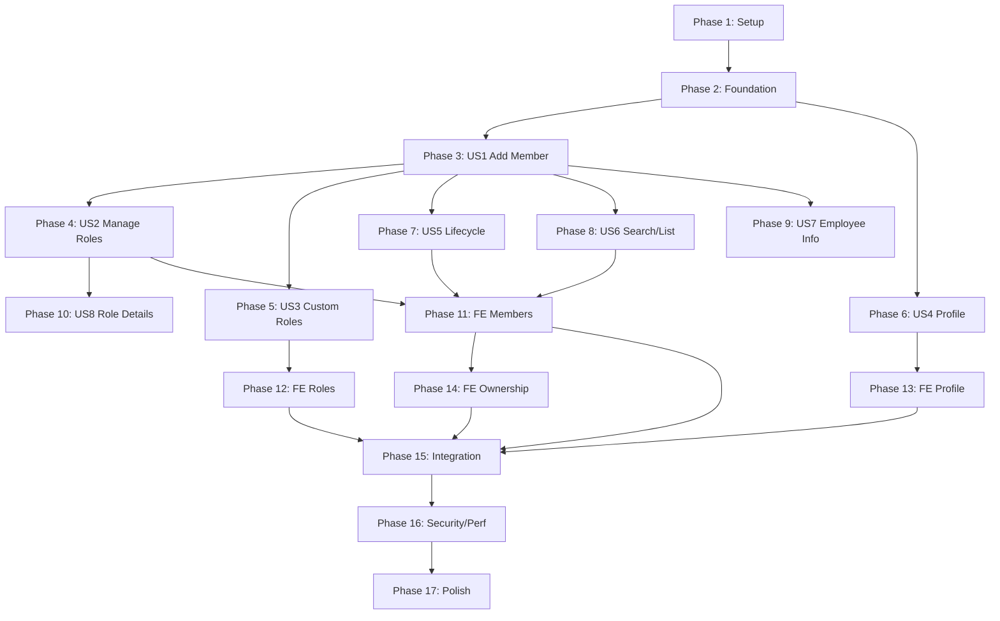
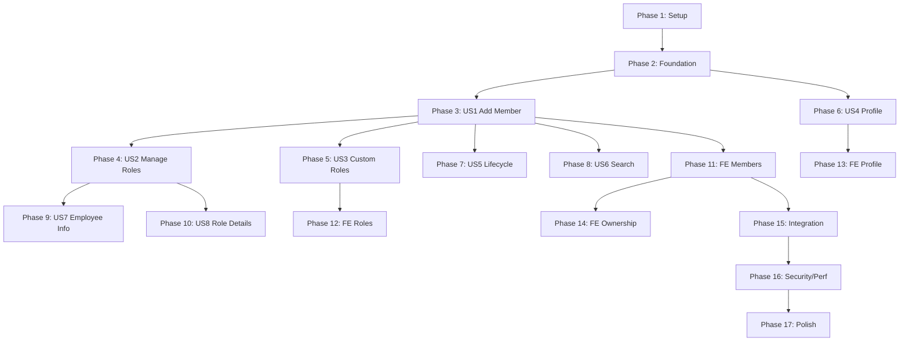

# Tasks: Epic 4 — Users & Roles

**Input**: Design documents from `/specs/004-users-roles/`
**Prerequisites**: spec.md (approved), plan.md (approved), data-model.md, contracts/, research.md, quickstart.md
**Branch**: `004-users-roles`
**Date**: 2026-07-17
**Status**: Ready for Implementation
**Version**: 1.0.0

---

## Epic Summary

Transform the single-owner company model (Epic 3) into a fully collaborative, multi-user, role-based workspace. Implements company membership, role hierarchy, permission registry, user profile/preferences, lifecycle state machine, ownership transfer, audit logging, and 11 frontend screens.

**User Stories (from spec.md)**:

| Story | Title | Priority | Backend | Frontend |
|-------|-------|----------|---------|----------|
| US1 | Owner Adds New Member | P1 | Phase 3 | Phase 11 |
| US2 | Admin Manages User Roles | P1 | Phase 4 | Phase 11 |
| US3 | Owner Creates Custom Roles | P2 | Phase 5 | Phase 12 |
| US4 | User Updates Profile | P2 | Phase 6 | Phase 13 |
| US5 | Admin Manages Lifecycle | P2 | Phase 7 | Phase 11 |
| US6 | Admin Views/Searches Members | P2 | Phase 8 | Phase 11 |
| US7 | Admin Manages Employee Info | P3 | Phase 9 | Phase 11 |
| US8 | View Role Details & Permissions | P3 | Phase 10 | Phase 12 |

---

## Implementation Flow

---

## Format: `[ID] [P?] [Story?] Description`

- **[P]**: Can run in parallel (different files, no dependencies on incomplete tasks in same phase)
- **[Story]**: Which user story this task belongs to (US1–US8)
- Include exact file paths in descriptions
- Tasks without [Story] label are infrastructure/cross-cutting

---

## Phase 1: Setup — Module Scaffolding

**Purpose**: Create the `users_roles` module directory structure and register it with the application.

**Business Objective**: Establish the engineering foundation before any feature work begins.

**Technical Objective**: Create all package directories, `__init__.py` files, and register the module router with the FastAPI application.

**Why this phase exists**: A clean module structure prevents merge conflicts and ensures all subsequent tasks have a target location for their files.

**Scope**: Directory creation, `__init__.py` files, router registration. No business logic.

**Dependencies**: Epic 2 (Auth) and Epic 3 (Companies) fully implemented and passing tests.

**Risks**: Router registration could conflict with existing routes if URL prefixes overlap. Mitigate by verifying existing route prefixes before registration.

**Expected Deliverables**: Module skeleton with empty packages.

**High-Level Files/Modules Expected to Change**:
- `backend/modules/users_roles/` (NEW — entire module tree)
- `backend/api/v1/router.py` (MODIFY — register new module router)

**Validation Requirements**: Application starts without errors after module registration.

**Required Testing**: Manual — verify `docker compose up` starts cleanly; verify `/api/v1/docs` shows the new router group.

**Completion Criteria**: Module directory tree exists; application starts; router registered.

### Tasks

- [X] T001 Create module directory structure for `backend/modules/users_roles/` with subdirectories: `models/`, `repositories/`, `services/`, `schemas/`
- [X] T002 [P] Create `__init__.py` files for all packages in `backend/modules/users_roles/` and its subdirectories
- [X] T003 [P] Create empty `backend/modules/users_roles/router.py` with FastAPI APIRouter (prefix="/companies/{company_id}", tags=["Users & Roles"])
- [X] T004 [P] Create empty `backend/modules/users_roles/dependencies.py` with placeholder DI factories
- [X] T005 Register users_roles router in `backend/api/v1/router.py`
- [X] T006 Verify application starts cleanly with `docker compose up` and new router appears in OpenAPI docs

**Checkpoint**: Application runs with empty users_roles module registered. No functionality yet.

---

## Phase 2: Foundation — Database, Models, Enums, Constants, Configuration, Exceptions & Events

**Purpose**: Establish the complete data layer, configuration, exception hierarchy, and domain event definitions that ALL user stories depend on.

**Business Objective**: Build the structural foundation (tables, models, enums, config, exceptions) upon which every user story will be implemented.

**Technical Objective**: Create Alembic migration for 5 new tables + User extension; SQLAlchemy models; enums; constants; configuration settings; exception classes; domain event dataclasses.

**Why this phase exists**: Every user story depends on the database tables, models, enums, and exception classes. This phase MUST complete before any user story work begins.

**Scope**: Database migration, ORM models, enums, constants, configuration, exceptions, domain events. No services, repositories, or API endpoints.

**Dependencies**: Phase 1 complete. Existing `users` and `companies` tables from Epics 2 and 3.

**Risks**:
- Migration may conflict with existing table constraints. Mitigate: test migration on fresh DB and existing DB.
- Enum values must match spec exactly. Mitigate: cross-reference spec BR-020 for status values.

**Expected Deliverables**: Alembic migration; 6 SQLAlchemy models; 2 enums; constants file; 6 config settings; 18 exception classes; 12 event dataclasses.

**High-Level Files/Modules Expected to Change**:
- `backend/migrations/versions/004_users_roles.py` (NEW)
- `backend/modules/users_roles/models/` (NEW — all model files)
- `backend/modules/users_roles/constants.py` (NEW)
- `backend/modules/users_roles/exceptions.py` (NEW)
- `backend/modules/users_roles/events.py` (NEW)
- `backend/modules/users_roles/validators.py` (NEW)
- `backend/core/config/settings.py` (MODIFY — add 6 new settings)

**Technical Notes**:
- Models MUST use SQLAlchemy 2.x `Mapped[T]` syntax per Constitution §6.2
- CompanyMember and Role inherit from `TenantBaseModel` (company-scoped)
- Permission inherits from `BaseModel` (global, not company-scoped)
- UserPreference inherits from `BaseModel` (user-scoped, not company-scoped)
- System role definitions in constants.py must match spec FR-040 exactly: Owner=100, Admin=80, Manager=60, Accountant=55, Salesperson=50, Cashier=45, Store Keeper=42, Viewer=20
- Initial permission codes must match spec Section 6.1: 14 permissions across 4 modules

**Validation Requirements**:
- `alembic upgrade head` succeeds
- `alembic downgrade -1` succeeds (rollback)
- All models pass mypy/pyright type checking
- Enum values match spec BR-020 exactly

**Required Testing**:
- Migration up/down test
- Model instantiation tests
- Type checking passes

**Review Checklist**:
- [ ] Migration creates all 5 tables with correct columns and constraints
- [ ] Migration extends `users` table with 3 new columns
- [ ] Migration includes rollback (downgrade function)
- [ ] All indexes from data-model.md created
- [ ] Foreign key constraints match data-model.md cascade rules
- [ ] Enum values match spec exactly
- [ ] Constants match spec FR-040 role definitions
- [ ] All 6 config settings have sensible defaults
- [ ] Exception hierarchy matches plan Section 18.1

**Architecture Validation**: Models follow Clean Architecture — no business logic in models. TenantBaseModel used for company-scoped entities.

**Security Validation**: No secrets in migration. Configuration uses environment variables.

**Docker Verification**: `docker compose up` starts cleanly; `alembic upgrade head` succeeds in container.

**Completion Criteria**: All tables exist; models type-check; migration is reversible; constants match spec.

### Tasks

- [X] T007 Create enum definitions in `backend/modules/users_roles/models/enums.py` — MembershipStatus (pending_invitation, active, inactive, suspended, locked, archived) and PermissionAction (create, read, update, delete, manage, export)
- [X] T008 [P] Create constants file `backend/modules/users_roles/constants.py` with system role definitions (8 roles with name, slug, rank, description), initial permission codes (14 permissions), and role-permission matrix
- [X] T009 [P] Add 6 new configuration settings to `backend/core/config/settings.py` — COMPANY_MAX_MEMBERS (100), USER_AVATAR_MAX_BYTES (2097152), AVATAR_RETENTION_DAYS (7), MEMBER_DELETION_RETENTION_DAYS (90), MAX_CUSTOM_ROLES_PER_COMPANY (50), INVITATION_EXPIRY_DAYS (7)
- [X] T010 Create CompanyMember model in `backend/modules/users_roles/models/company_member.py` — all fields from data-model.md Section 2.1 with TenantBaseModel inheritance, FK relationships, and indexes
- [X] T011 [P] Create Role model in `backend/modules/users_roles/models/role.py` — all fields from data-model.md Section 2.2 with TenantBaseModel inheritance, FK relationships, unique constraints, and indexes
- [X] T012 [P] Create Permission model in `backend/modules/users_roles/models/permission.py` — all fields from data-model.md Section 2.3 with BaseModel inheritance (global, not company-scoped), unique constraint on code
- [X] T013 [P] Create RolePermission model in `backend/modules/users_roles/models/role_permission.py` — join entity from data-model.md Section 2.4 with cascade delete on role removal
- [X] T014 [P] Create UserPreference model in `backend/modules/users_roles/models/user_preference.py` — all fields from data-model.md Section 2.5 with BaseModel inheritance, 1:1 FK to users, JSONB for notification_preferences
- [X] T015 Create models `__init__.py` in `backend/modules/users_roles/models/__init__.py` — export all models for Alembic discovery
- [X] T016 Create Alembic migration `backend/migrations/versions/004_users_roles.py` — creates company_members, roles, permissions, role_permissions, user_preferences tables; extends users table with avatar_url, avatar_previous_url, phone; creates all indexes and constraints from data-model.md; includes downgrade function
- [X] T017 Create exception hierarchy in `backend/modules/users_roles/exceptions.py` — UsersRolesException base plus 18 specific exceptions from plan Section 18.1 (MemberNotFoundError, MemberAlreadyExistsError, MemberLimitExceededError, InvalidStatusTransitionError, InsufficientRankError, LastOwnerProtectionError, CannotModifyOwnRoleError, RoleNotFoundError, RoleNameConflictError, RoleHasActiveAssignmentsError, SystemRoleImmutableError, CustomRoleLimitExceededError, InvalidRoleRankError, EmployeeIdConflictError, InvitationExpiredError, AvatarTooLargeError, AvatarInvalidFormatError, AvatarInvalidContentError)
- [X] T018 [P] Create domain event dataclasses in `backend/modules/users_roles/events.py` — 12 events from plan Section 6.3 (MemberCreatedEvent, MemberRoleChangedEvent, MemberDeactivatedEvent, MemberSuspendedEvent, MemberLockedEvent, MemberArchivedEvent, MemberRestoredEvent, OwnershipTransferredEvent, RoleCreatedEvent, RoleUpdatedEvent, RoleDeletedEvent, InvitationAcceptedEvent)
- [X] T019 [P] Create field validators in `backend/modules/users_roles/validators.py` — email format, phone format, employee_id format, role name rules, rank range validation, department string, date validators per spec Section 9
- [X] T020 Run and verify Alembic migration — `alembic upgrade head` succeeds; verify all tables exist with correct columns; run `alembic downgrade -1` to verify rollback; run `alembic upgrade head` again

**Checkpoint**: All database tables exist. All models type-check. Migration is reversible. All supporting definitions (enums, constants, config, exceptions, events, validators) are ready. No API or business logic yet.

---

## Phase 3: US1 — Owner Adds a New Member to the Company (Priority: P1)

**Goal**: Enable Owner/Admin to add a new user to their company with a role assignment. This is the foundational membership capability.

**Independent Test**: Create a company → add a user with role → verify member appears in DB with correct company_id, role_id, and status.

**Business Objective**: Without adding members, companies remain single-user. This unlocks all collaborative features (FR-001 through FR-006).

**Technical Objective**: Implement CompanyMemberRepository, RoleRepository, PermissionRepository, RoleSeedService, MemberService (add member flow), InvitationService, and the POST /members endpoint.

**Why this phase exists**: US1 is the most critical P1 story. Every other story depends on members existing in a company. The add-member flow also triggers role seeding (first member is the Owner created at company creation time).

**Scope**: Repositories for CompanyMember, Role, Permission, RolePermission. Services for role seeding, member creation, invitation. Schemas and router endpoint for adding a member. Audit logging for MEMBER_CREATED.

**Dependencies**: Phase 2 complete (tables, models, enums, constants, exceptions).

**Risks**:
- Role seeding race condition on concurrent company creation. Mitigate: database unique constraints + idempotent seed function.
- Duplicate membership prevention must handle archived members (BR-044). Mitigate: check for existing archived membership before creating new one.

**Expected Deliverables**: 4 repositories, 3 services, Pydantic schemas, router endpoint, test fixtures.

**High-Level Files/Modules Expected to Change**:
- `backend/modules/users_roles/repositories/` (NEW — 4 repository files)
- `backend/modules/users_roles/services/` (NEW — role_seed_service, member_service, invitation_service)
- `backend/modules/users_roles/schemas/` (NEW — member.py, invitation.py)
- `backend/modules/users_roles/router.py` (MODIFY — add POST /members endpoint)
- `backend/modules/users_roles/dependencies.py` (MODIFY — add DI factories)
- `backend/tests/fixtures/users_roles_fixtures.py` (NEW)

**Technical Notes**:
- RoleSeedService must be idempotent — calling it twice for the same company must not create duplicate roles
- When adding a member with an unregistered email, service creates user via Auth module's user creation (or marks membership as pending_invitation)
- When adding a member with an already-archived membership (BR-044), reactivate the existing record
- Every repository method MUST include company_id in WHERE clause (BR-050)
- Member creation must check COMPANY_MAX_MEMBERS limit (FR-006)

**Validation Requirements**:
- POST /members creates a CompanyMember record
- Duplicate membership returns 409 (MemberAlreadyExistsError)
- Member limit exceeded returns 409 (MemberLimitExceededError)
- Invalid role_id returns 404 (RoleNotFoundError)
- Audit log entry created for MEMBER_CREATED
- Domain event MemberCreatedEvent written to outbox

**Required Testing**: Unit tests for MemberService.add_member (happy path, duplicate, limit exceeded, archived reactivation). Integration test for POST /members endpoint. Repository tests for company-scoped queries.

**Review Checklist**:
- [ ] All repository methods include company_id parameter
- [ ] RoleSeedService is idempotent
- [ ] MemberService checks rank enforcement (actor.rank > assigned_role.rank)
- [ ] Archived membership reactivation logic works (BR-044)
- [ ] Member limit check uses configurable setting
- [ ] Audit log written in same transaction as member creation
- [ ] Domain event written to outbox in same transaction

**Completion Criteria**: Owner can add a member via API; member appears in DB with correct company_id, user_id, role_id, and status; duplicate prevention works; audit log created.

### Implementation

- [X] T021 [US1] Create CompanyMemberRepository in `backend/modules/users_roles/repositories/company_member_repository.py` — extends BaseRepository; all methods require company_id; includes: create, get_by_id, get_by_user_id, get_by_company_and_user, list_by_company (with status/role/department filters), count_by_company, update, soft_delete; handles archived member lookup for reactivation (BR-044)
- [X] T022 [P] [US1] Create RoleRepository in `backend/modules/users_roles/repositories/role_repository.py` — extends BaseRepository; all methods require company_id; includes: create, get_by_id, get_by_slug, list_by_company, get_system_roles, count_custom_roles, update, delete; handles system role seeding
- [X] T023 [P] [US1] Create PermissionRepository in `backend/modules/users_roles/repositories/permission_repository.py` — extends BaseRepository; global scope (no company_id); includes: get_by_id, get_by_code, list_all, list_by_module; read-only (permissions are seeded via migration)
- [X] T024 [P] [US1] Create RolePermissionRepository in `backend/modules/users_roles/repositories/role_permission_repository.py` — includes: create, delete, get_permissions_for_role, get_roles_for_permission, bulk_set_permissions_for_role
- [X] T025 Create repositories `__init__.py` in `backend/modules/users_roles/repositories/__init__.py` — export all repository classes
- [X] T026 [US1] Create RoleSeedService in `backend/modules/users_roles/services/role_seed_service.py` — seeds 8 system roles with ranks from constants.py; seeds 14 initial permissions (idempotent); creates role-permission mappings from matrix in constants.py; called on company creation
- [X] T027 [US1] Create MemberService in `backend/modules/users_roles/services/member_service.py` — implements add_member method: validates company membership limit (FR-006), checks for duplicate membership (FR-005), handles archived member reactivation (BR-044), checks actor rank >= assigned role rank (BR-011), creates CompanyMember record, writes audit log (MEMBER_CREATED), publishes MemberCreatedEvent to outbox
- [X] T028 [US1] Create InvitationService in `backend/modules/users_roles/services/invitation_service.py` — handles invitation creation for unregistered emails (creates pending_invitation membership), invitation acceptance (status → active), re-invitation for expired invitations (BR-061), expiry checking
- [X] T029 Create services `__init__.py` in `backend/modules/users_roles/services/__init__.py` — export all service classes
- [X] T030 [P] [US1] Create member Pydantic schemas in `backend/modules/users_roles/schemas/member.py` — AddMemberRequest (email, role_id, optional employee info), MemberResponse, MemberListItem, MemberDetailResponse per contracts/members-api.yaml
- [X] T031 [P] [US1] Create invitation Pydantic schemas in `backend/modules/users_roles/schemas/invitation.py` — InviteRequest, InvitationResponse per contracts/members-api.yaml
- [X] T032 Create schemas `__init__.py` in `backend/modules/users_roles/schemas/__init__.py` — export all schema classes
- [X] T033 [US1] Add DI factories to `backend/modules/users_roles/dependencies.py` — get_member_service(), get_role_service(), get_invitation_service(), get_role_seed_service(), get_current_company_member() dependency that validates active membership in target company
- [X] T034 [US1] Implement POST /companies/{company_id}/members endpoint in `backend/modules/users_roles/router.py` — validates auth, calls MemberService.add_member, returns 201 with MemberResponse, rate limited
- [X] T035 [P] [US1] Create test fixtures in `backend/tests/fixtures/users_roles_fixtures.py` — create_test_member, create_test_role, create_test_permission, seed_system_roles, create_member_with_role factory functions
- [X] T036 [US1] Create unit tests for MemberService.add_member in `backend/tests/unit/modules/users_roles/test_member_service.py` — test happy path, duplicate membership, limit exceeded, archived reactivation, rank enforcement
- [X] T037 [US1] Create unit tests for RoleSeedService in `backend/tests/unit/modules/users_roles/test_role_seed_service.py` — test seeding creates 8 roles, idempotency, permission mapping
- [X] T038 [US1] Create integration test for POST /members in `backend/tests/integration/api/v1/users_roles/test_add_member.py` — test successful add, duplicate 409, limit exceeded 409, invalid role 404, audit log created
- [X] T039 [US1] Create repository integration tests in `backend/tests/integration/repositories/users_roles/test_company_member_repository.py` — test CRUD, company-scoped queries, unique constraint enforcement

**Checkpoint**: Members can be added to companies via POST /members. Role seeding works. Duplicate prevention works. Audit logging verified. All unit and integration tests pass.

---

## Phase 4: US2 — Admin Manages User Roles (Priority: P1)

**Goal**: Enable Admin+ to assign, change, and verify role assignments for company members. Enforce rank-based management hierarchy.

**Independent Test**: Add a member with role "Viewer" → change their role to "Manager" → verify role updated in DB and audit log records before/after state.

**Business Objective**: Role assignment is the core RBAC operation. Without it, all members would have identical access (FR-044, FR-045, BR-010 through BR-014).

**Technical Objective**: Implement role change in MemberService; enforce rank-based management hierarchy; add PATCH /members/{member_id} endpoint for role changes; audit MEMBER_ROLE_CHANGED.

**Scope**: Role change logic, rank enforcement, self-role-change prevention, last Owner protection for demotion.

**Dependencies**: Phase 3 complete (MemberService, repositories, schemas).

**Risks**: Rank enforcement edge cases (what happens when Admin tries to change another Admin's role). Mitigate: strict `actor.rank > target.rank` comparison.

**Expected Deliverables**: Role change method in MemberService; PATCH /members endpoint; role schema; unit and integration tests.

**Completion Criteria**: Admin can change a member's role via API; rank hierarchy enforced; self-role-change rejected; last Owner protection works; audit log records before/after state.

### Implementation

- [X] T040 [US2] Add change_role method to MemberService in `backend/modules/users_roles/services/member_service.py` — validates actor.rank > target.rank (BR-011), prevents self-role-change (BR-013), validates role exists in company registry (BR-010), validates not demoting last Owner (BR-001), updates role_id, writes audit log (MEMBER_ROLE_CHANGED with before/after), publishes MemberRoleChangedEvent
- [X] T041 [P] [US2] Create role Pydantic schemas in `backend/modules/users_roles/schemas/role.py` — CreateRoleRequest, UpdateRoleRequest, RoleResponse, RoleListItem, RoleDetailResponse per contracts/roles-api.yaml
- [X] T042 [US2] Create UpdateMemberRequest schema in `backend/modules/users_roles/schemas/member.py` — role_id, employee info fields per contracts/members-api.yaml
- [X] T043 [US2] Implement PATCH /companies/{company_id}/members/{member_id} endpoint in `backend/modules/users_roles/router.py` — validates auth and rank, calls MemberService.update_member (including role change), returns MemberDetailResponse
- [X] T044 [US2] Implement GET /companies/{company_id}/members/{member_id} endpoint in `backend/modules/users_roles/router.py` — returns MemberDetailResponse with role, employee info, status
- [X] T045 [US2] Add require_rank dependency to `backend/modules/users_roles/dependencies.py` — FastAPI dependency that checks current member's role rank meets minimum requirement for the endpoint
- [X] T046 [US2] Create unit tests for role change in `backend/tests/unit/modules/users_roles/test_member_service.py` — test rank enforcement, self-role-change prevention, last Owner protection, valid role change with audit
- [X] T047 [US2] Create integration test for role management in `backend/tests/integration/api/v1/users_roles/test_role_management.py` — test successful role change, insufficient rank 403, self-change 409, last Owner 409, invalid role 404

**Checkpoint**: Roles can be changed via PATCH /members/{member_id}. Rank hierarchy enforced. Self-role-change prevented. Last Owner protected. Audit logs verified.

---

## Phase 5: US3 — Owner Creates Custom Roles (Priority: P2)

**Goal**: Enable Owner/Admin to create, update, and delete custom roles with specific permission sets tailored to their organisation.

**Independent Test**: Create a custom role "Warehouse Supervisor" with selected permissions → verify role appears in company role registry → assign it to a member → verify assignment works.

**Business Objective**: System roles cover common cases, but enterprises need custom roles to match unique organisational structures (FR-042 through FR-048).

**Technical Objective**: Implement RoleService with CRUD for custom roles; enforce system role immutability; enforce custom role limits; add role CRUD endpoints.

**Scope**: Custom role creation, update, deactivation, deletion. Permission assignment to custom roles. System role protection.

**Dependencies**: Phase 3 complete (PermissionRepository, RoleRepository).

**Risks**: Custom role rank collision with system role ranks. Mitigate: database constraint + service-level validation. Role deletion with active assignments. Mitigate: check active member count before deletion (FR-046).

**Completion Criteria**: Custom roles can be created/updated/deleted via API; system roles are immutable; custom role limit enforced; permission assignment works; audit logged.

### Implementation

- [X] T048 [US3] Create RoleService in `backend/modules/users_roles/services/role_service.py` — create_custom_role (validates name uniqueness BR-031, rank range 1-99 FR-042, rank != system role ranks, custom role count < MAX_CUSTOM_ROLES_PER_COMPANY FR-048, assigns permissions), update_custom_role (validates is_system=false FR-041, updates name/description/rank/permissions), deactivate_role (sets is_active=false FR-047), delete_role (validates zero active assignments FR-046), list_roles (with member counts)
- [X] T049 [US3] Create PermissionService in `backend/modules/users_roles/services/permission_service.py` — list_all_permissions (grouped by module), get_permission_by_code, list_permissions_by_module
- [X] T050 [US3] Create permission Pydantic schemas in `backend/modules/users_roles/schemas/permission.py` — PermissionResponse, PermissionGroupResponse per contracts/roles-api.yaml
- [X] T051 [US3] Implement POST /companies/{company_id}/roles endpoint in `backend/modules/users_roles/router.py` — creates custom role with permissions, returns 201 RoleDetailResponse
- [X] T052 [US3] Implement PATCH /companies/{company_id}/roles/{role_id} endpoint in `backend/modules/users_roles/router.py` — updates custom role, rejects system role modification with 403
- [X] T053 [US3] Implement DELETE /companies/{company_id}/roles/{role_id} endpoint in `backend/modules/users_roles/router.py` — deletes custom role only if zero active assignments, returns 204 or 409
- [X] T054 [US3] Implement GET /permissions endpoint in `backend/modules/users_roles/router.py` — lists all permissions grouped by module (global, not company-scoped)
- [X] T055 [US3] Create unit tests for RoleService in `backend/tests/unit/modules/users_roles/test_role_service.py` — test create custom role, name conflict, rank validation, system role immutability, role limits, delete with active assignments, deactivation
- [X] T056 [US3] Create integration test for role CRUD in `backend/tests/integration/api/v1/users_roles/test_role_management.py` — extend with create, update, delete, system role protection tests

**Checkpoint**: Custom roles can be created, updated, deactivated, and deleted. System roles are immutable. Permission assignment works. Role limits enforced.

---

## Phase 6: US4 — User Updates Their Profile (Priority: P2)

**Goal**: Enable authenticated users to view and update their own profile (display name, phone, avatar) and preferences (language, timezone, theme).

**Independent Test**: Login → update display name and upload avatar → verify changes persisted → update preferences → verify theme/timezone applied.

**Business Objective**: User profiles are essential for collaboration and personalisation (FR-010 through FR-015).

**Technical Objective**: Implement ProfileService (display name, phone, avatar upload/delete using S3), PreferenceService (CRUD for UserPreference), UserPreferenceRepository, and profile/preferences endpoints.

**Scope**: Profile read/update, avatar upload/delete, preferences read/update. Self-service only — no admin involvement.

**Dependencies**: Phase 2 complete (UserPreference model, User extension columns). S3 storage patterns from Epic 3.

**Risks**: Avatar upload abuse (large files, invalid formats). Mitigate: MIME validation by magic bytes, file size limit, rate limiting. Previous avatar retention must not fill storage. Mitigate: configurable retention with cleanup.

**Completion Criteria**: Users can update profile and preferences via API; avatar upload/delete works; previous avatar retained; preferences have sensible defaults.

### Implementation

- [X] T057 [US4] Create UserPreferenceRepository in `backend/modules/users_roles/repositories/user_preference_repository.py` — extends BaseRepository; user-scoped (not company-scoped); includes: get_by_user_id, create_or_update, create_with_defaults
- [X] T058 [US4] Create ProfileService in `backend/modules/users_roles/services/profile_service.py` — get_profile (returns user with avatar), update_profile (display_name, phone), upload_avatar (validates format/size, uploads to S3 using pattern from Epic 3, stores previous URL for retention, updates user.avatar_url), delete_avatar (clears avatar_url, retains file for AVATAR_RETENTION_DAYS), writes audit log (PROFILE_UPDATED, AVATAR_UPLOADED, AVATAR_REMOVED)
- [X] T059 [P] [US4] Create PreferenceService in `backend/modules/users_roles/services/preference_service.py` — get_preferences (creates with defaults if not exists), update_preferences (validates language, timezone, date_format, theme against allowed values), writes audit log (PREFERENCES_UPDATED)
- [X] T060 [P] [US4] Create profile Pydantic schemas in `backend/modules/users_roles/schemas/profile.py` — UpdateProfileRequest (display_name, phone), ProfileResponse per contracts/profile-api.yaml
- [X] T061 [P] [US4] Create preference Pydantic schemas in `backend/modules/users_roles/schemas/preference.py` — UpdatePreferenceRequest, PreferenceResponse per contracts/profile-api.yaml
- [X] T062 [US4] Add DI factories for ProfileService and PreferenceService to `backend/modules/users_roles/dependencies.py` — get_profile_service(), get_preference_service()
- [X] T063 [US4] Implement profile endpoints in `backend/modules/users_roles/router.py` — GET /profile, PATCH /profile, POST /profile/avatar (multipart), DELETE /profile/avatar
- [X] T064 [US4] Implement preference endpoints in `backend/modules/users_roles/router.py` — GET /preferences, PUT /preferences
- [X] T065 [US4] Create unit tests for ProfileService in `backend/tests/unit/modules/users_roles/test_profile_service.py` — test profile update, avatar upload valid format, avatar too large, invalid format, avatar delete, previous URL retention
- [X] T066 [US4] Create unit tests for PreferenceService in `backend/tests/unit/modules/users_roles/test_preference_service.py` — test get with defaults, update, invalid timezone/language rejection
- [X] T067 [US4] Create integration tests for profile and preferences in `backend/tests/integration/api/v1/users_roles/test_profile.py` and `backend/tests/integration/api/v1/users_roles/test_preferences.py`

**Checkpoint**: Users can update their own profile and preferences. Avatar upload/delete works via S3. Preferences have defaults. All tests pass.

---

## Phase 7: US5 — Admin Manages User Lifecycle (Priority: P2)

**Goal**: Enable Admin+ to deactivate, suspend, lock, reactivate, and archive members following the defined state machine.

**Independent Test**: Deactivate a member → verify status=inactive and sessions revoked → reactivate → verify status=active → suspend with reason → archive → restore within retention period.

**Business Objective**: Lifecycle management is critical for security (revoking access) and compliance (retaining records) per FR-030 through FR-037.

**Technical Objective**: Implement membership state machine in MemberService; integrate session revocation from Auth module; enforce all status transition rules from BR-020; add lifecycle endpoints.

**Scope**: All status transitions from BR-020. Session revocation on deactivate/suspend/lock/archive. Last Owner protection. Reason requirements for suspend/archive.

**Dependencies**: Phase 3 complete (MemberService, CompanyMemberRepository). Epic 2 session revocation service.

**Risks**: Session revocation failure could leave active sessions for deactivated users. Mitigate: synchronous revocation within same service method; retry on failure. State machine edge cases (archived → suspended is invalid). Mitigate: explicit transition validation.

**Completion Criteria**: All valid transitions work; invalid transitions rejected with 409; sessions revoked on status change; reasons required for suspend/archive; last Owner protected; audit logged for each transition.

### Implementation

- [X] T068 [US5] Add lifecycle methods to MemberService in `backend/modules/users_roles/services/member_service.py` — deactivate_member (status→inactive, revoke sessions, audit MEMBER_DEACTIVATED), reactivate_member (from inactive/suspended/locked→active, audit MEMBER_REACTIVATED or MEMBER_UNSUSPENDED or MEMBER_UNLOCKED), suspend_member (requires reason, status→suspended, revoke sessions, audit MEMBER_SUSPENDED), lock_member (status→locked, revoke sessions, audit MEMBER_LOCKED), archive_member (requires reason, status→archived, set deleted_at, revoke sessions, audit MEMBER_ARCHIVED), restore_member (from archived→active, clear deleted_at, audit MEMBER_RESTORED)
- [X] T069 [US5] Implement state machine validation in MemberService — validate_transition method that checks BR-020 valid transitions; raises InvalidStatusTransitionError for invalid paths (e.g., archived→suspended)
- [X] T070 [US5] Integrate session revocation in MemberService — call Auth module session revocation service when member is deactivated, suspended, locked, or archived (FR-035); revocation happens within same transaction
- [X] T071 [P] [US5] Create member status Pydantic schemas in `backend/modules/users_roles/schemas/member_status.py` — SuspendRequest (reason required), ArchiveRequest (reason required)
- [X] T072 [US5] Implement lifecycle endpoints in `backend/modules/users_roles/router.py` — POST /members/{member_id}/deactivate, POST /members/{member_id}/suspend, POST /members/{member_id}/lock, POST /members/{member_id}/reactivate, POST /members/{member_id}/archive, POST /members/{member_id}/restore
- [X] T073 [US5] Create unit tests for lifecycle state machine in `backend/tests/unit/modules/users_roles/test_member_service.py` — test all valid transitions, all invalid transitions, reason requirements, last Owner protection, session revocation called
- [X] T074 [US5] Create integration test for lifecycle endpoints in `backend/tests/integration/api/v1/users_roles/test_member_lifecycle.py` — test full lifecycle: active→inactive→active, active→suspended→active, active→locked→active, active→archived→active (restore), invalid transitions return 409, last Owner returns 409

**Checkpoint**: All membership lifecycle transitions work via API. Invalid transitions rejected. Sessions revoked on status change. Last Owner protected. Audit log records all transitions.

---

## Phase 8: US6 — Admin Views and Searches Company Members (Priority: P2)

**Goal**: Enable Admin+ to view a paginated, filterable, searchable list of all company members.

**Independent Test**: Create company with 50 members → list with page_size=20 → verify pagination → filter by department → verify results → search by name → verify matches.

**Business Objective**: Essential for operational management of members (FR-070 through FR-074).

**Technical Objective**: Implement paginated member listing with filters (status, role, department, date range) and text search (display name, email) in CompanyMemberRepository and MemberService; add GET /members endpoint.

**Scope**: Paginated listing, filtering, sorting, text search. No lifecycle operations (those are in Phase 7).

**Dependencies**: Phase 3 complete (CompanyMemberRepository, MemberService).

**Risks**: Performance with large member lists (1000+). Mitigate: database-level pagination (LIMIT/OFFSET), indexes on (company_id, status), (company_id, department).

**Completion Criteria**: Members listed with pagination; all filters work; text search works; sorting works; p95 < 500ms with 1000 members.

### Implementation

- [X] T075 [US6] Add list_members method to MemberService in `backend/modules/users_roles/services/member_service.py` — accepts filters (status, role_id, department, search_term, date_range, sort_by, sort_order, page, page_size), delegates to repository, returns PaginatedResponse with MemberListItems
- [X] T076 [US6] Enhance CompanyMemberRepository in `backend/modules/users_roles/repositories/company_member_repository.py` — add list_by_company_filtered method with optional filters, case-insensitive LIKE search on display_name/email, sort support (name, created_at, role_rank, department), pagination (LIMIT/OFFSET)
- [X] T077 [US6] Implement GET /companies/{company_id}/members endpoint in `backend/modules/users_roles/router.py` — accepts query parameters (status, role_id, department, search, cursor, limit, sort_by, sort_order), returns PaginatedResponse[MemberListItem] per contracts/members-api.yaml
- [X] T078 [US6] Implement GET /companies/{company_id}/roles endpoint in `backend/modules/users_roles/router.py` — returns all roles with member counts per contracts/roles-api.yaml
- [X] T079 [US6] Create integration test for member listing in `backend/tests/integration/api/v1/users_roles/test_member_listing.py` — test pagination, status filter, role filter, department filter, text search, sorting

**Checkpoint**: Members can be listed, filtered, searched, and sorted via GET /members. Pagination works correctly. Role listing with member counts works.

---

## Phase 9: US7 — Admin Manages Employee Information (Priority: P3)

**Goal**: Enable Admin+ to record and update employee information (job title, department, employee ID, hire date, notes) for company members.

**Independent Test**: Set member's job title and department → retrieve member → verify fields displayed → update department → verify change and audit log.

**Business Objective**: Employee metadata enriches the user model for organisational structure (FR-020 through FR-024).

**Technical Objective**: Extend MemberService.update_member to handle employee info fields; enforce employee_id uniqueness (BR-032); restrict notes visibility to Admin+ (FR-023).

**Scope**: Employee info CRUD via existing PATCH /members/{member_id} endpoint. Employee ID uniqueness. Notes visibility restriction.

**Dependencies**: Phase 4 complete (PATCH /members endpoint exists).

**Risks**: Employee ID uniqueness across non-archived members only (BR-032). Mitigate: partial unique index.

**Completion Criteria**: Employee info can be set and updated via PATCH /members; employee_id uniqueness enforced; notes hidden from members with rank < 80; audit logged.

### Implementation

- [X] T080 [US7] Extend update_member in MemberService (`backend/modules/users_roles/services/member_service.py`) — handle employee_id, job_title, department, work_phone, hire_date, notes fields; validate employee_id uniqueness within company (BR-032); validate hire_date not in future; write audit log (MEMBER_UPDATED with before/after)
- [X] T081 [US7] Add notes visibility filtering to MemberDetailResponse in `backend/modules/users_roles/schemas/member.py` — exclude notes field when requesting user's rank < 80 (Admin threshold per FR-023)
- [X] T082 [US7] Create unit tests for employee info update in `backend/tests/unit/modules/users_roles/test_member_service.py` — test employee_id uniqueness, hire date validation, notes visibility
- [X] T083 [US7] Create integration test for employee info in `backend/tests/integration/api/v1/users_roles/test_member_listing.py` — extend with employee info update, duplicate employee_id 409

**Checkpoint**: Employee information can be managed via existing PATCH /members endpoint. Employee ID uniqueness enforced. Notes visibility restricted.

---

## Phase 10: US8 — View Role Details and Permissions (Priority: P3)

**Goal**: Enable Admin+ to view all available roles, their descriptions, assigned permissions (grouped by module), and member counts.

**Independent Test**: List roles → select a system role → verify permission set displayed grouped by module → verify member count accurate.

**Business Objective**: Transparency into role/permission structure supports better administration (FR-074).

**Technical Objective**: Implement GET /roles/{role_id} endpoint returning full permission set and assigned member count; ensure system role details show immutable marker.

**Scope**: Role detail view with permissions. Permission grouping by module. Member count per role.

**Dependencies**: Phase 5 complete (RoleService, role schemas).

**Completion Criteria**: Role details show full permission set grouped by module; member counts accurate; system vs custom roles clearly distinguished.

### Implementation

- [X] T084 [US8] Implement GET /companies/{company_id}/roles/{role_id} endpoint in `backend/modules/users_roles/router.py` — returns RoleDetailResponse with permissions list (grouped by module) and member_count per contracts/roles-api.yaml
- [X] T085 [US8] Add get_role_with_permissions method to RoleService in `backend/modules/users_roles/services/role_service.py` — loads role with permissions joined, counts assigned members, returns detailed response
- [X] T086 [US8] Create integration test for role details in `backend/tests/integration/api/v1/users_roles/test_permission_listing.py` — test role detail view, permission grouping, member count, system role identification

**Checkpoint**: Role details viewable with full permission set and member counts. Backend API for Users & Roles is feature-complete.

---

## Phase 11: Frontend — Member Management (US1, US2, US5, US6, US7)

**Purpose**: Build the frontend member management screens covering user stories 1, 2, 5, 6, and 7.

**Business Objective**: Enable company administrators to manage members through the web interface.

**Technical Objective**: Implement MemberListPage, AddMemberPage, MemberDetailPage, EditMemberPage with React Query hooks, form validation, and permission-aware UI.

**Why this phase exists**: The backend is feature-complete for member operations. The frontend translates API capabilities into a usable interface.

**Scope**: 4 member pages + shared components (MemberTable, MemberStatusBadge, MemberStatusActions, AddMemberForm, EditMemberForm). API client functions. React Query hooks. Zod validation schemas.

**Dependencies**: Backend Phases 3-9 complete (all member API endpoints functional).

**Risks**: API contract mismatch between frontend schemas and backend responses. Mitigate: generate Zod schemas from OpenAPI contracts.

**Expected Deliverables**: 4 pages, 6 components, 4 hooks, API client, Zod schemas.

**Required Testing**: Manual testing of all flows. Jest tests for form validation.

**Completion Criteria**: Members can be listed, added, viewed, edited, and have their status changed through the UI. Rank-based UI visibility works.

### Implementation

- [X] T087 Create API client functions in `frontend/src/lib/api/users-roles.ts` — fetch wrappers for all member endpoints (list, get, add, update, deactivate, suspend, lock, reactivate, archive, restore) per contracts/members-api.yaml
- [X] T088 [P] Create Zod validation schemas in `frontend/src/schemas/users-roles.ts` — AddMemberSchema, UpdateMemberSchema, SuspendSchema (reason required), ArchiveSchema (reason required) mirroring backend Pydantic schemas
- [X] T089 Create React Query hooks in `frontend/src/hooks/users-roles/useMembers.ts` — useMembers(companyId, filters) query, useAddMember mutation, useUpdateMember mutation, useChangeMemberStatus mutation per plan Section 10.2 cache strategy
- [X] T090 [P] Create React Query hook in `frontend/src/hooks/users-roles/useMember.ts` — useMember(companyId, memberId) single member query
- [X] T091 Create CompanyMemberProvider context in `frontend/src/components/users-roles/CompanyMemberProvider.tsx` — extends CompanyContext with current member's role, rank, and status
- [X] T092 [P] Create RequireRank guard component in `frontend/src/components/users-roles/RequireRank.tsx` — hides children when current user's rank is below required threshold
- [X] T093 [P] Create MemberStatusBadge component in `frontend/src/components/users-roles/MemberStatusBadge.tsx` — status pill with color coding (active=green, inactive=gray, suspended=orange, locked=red, pending=blue, archived=gray-striped)
- [X] T094 Create MemberTable component in `frontend/src/components/users-roles/MemberTable.tsx` — paginated table using shadcn/ui DataTable; columns: avatar, name, email, role, department, status, actions; supports sorting, filtering, search
- [X] T095 Create AddMemberForm component in `frontend/src/components/users-roles/AddMemberForm.tsx` — email input, role selector dropdown, optional employee info (job title, department, employee ID); validates with Zod schema; uses useAddMember mutation
- [X] T096 Create EditMemberForm component in `frontend/src/components/users-roles/EditMemberForm.tsx` — role change, employee info update; validates with Zod schema; uses useUpdateMember mutation
- [X] T097 Create MemberStatusActions component in `frontend/src/components/users-roles/MemberStatusActions.tsx` — deactivate/suspend/lock/archive/reactivate/restore buttons based on current status and actor rank; confirmation dialogs for destructive actions; reason input for suspend/archive
- [X] T098 Create MemberListPage in `frontend/src/app/(protected)/(companies)/companies/[id]/members/page.tsx` — renders MemberTable with search, filters (status, role, department), pagination; Admin+ access via RequireRank
- [X] T099 Create AddMemberPage in `frontend/src/app/(protected)/(companies)/companies/[id]/members/add/page.tsx` — renders AddMemberForm; navigates to member list on success; Admin+ access
- [X] T100 Create MemberDetailPage in `frontend/src/app/(protected)/(companies)/companies/[id]/members/[memberId]/page.tsx` — displays member profile, role badge, employee info, status badge, status actions; Admin+ access (or self-view for any member)
- [X] T101 Create EditMemberPage in `frontend/src/app/(protected)/(companies)/companies/[id]/members/[memberId]/edit/page.tsx` — renders EditMemberForm with current member data; Admin+ access

**Checkpoint**: Members can be listed, added, viewed, edited, and have their lifecycle managed through the web UI. Rank-based visibility works.

---

## Phase 12: Frontend — Role Management (US3, US8)

**Purpose**: Build the frontend role management screens covering user stories 3 and 8.

**Business Objective**: Enable Owner/Admin to manage custom roles and view role/permission details through the UI.

**Technical Objective**: Implement RoleListPage, CreateRolePage, EditRolePage, RoleDetailPage with permission checklist.

**Scope**: 4 role pages + shared components (RoleTable, RoleForm, RolePermissionChecklist, RoleBadge). React Query hooks.

**Dependencies**: Phase 11 complete (CompanyMemberProvider, RequireRank components available). Backend Phases 5 and 10 complete.

**Completion Criteria**: Roles can be listed, created, edited, deactivated, deleted, and viewed with permission sets through the UI.

### Implementation

- [X] T102 Add role API functions to `frontend/src/lib/api/users-roles.ts` — fetch wrappers for role endpoints (list, get, create, update, delete) and permissions endpoint (list all)
- [X] T103 Create React Query hooks in `frontend/src/hooks/users-roles/useRoles.ts` — useRoles(companyId) query, useCreateRole mutation, useUpdateRole mutation, useDeleteRole mutation
- [X] T104 [P] Create React Query hook in `frontend/src/hooks/users-roles/useRole.ts` — useRole(companyId, roleId) single role query with permissions
- [X] T105 [P] Create React Query hook in `frontend/src/hooks/users-roles/usePermissions.ts` — usePermissions() global permission list query (stale time: 30 minutes)
- [X] T106 Create RoleTable component in `frontend/src/components/users-roles/RoleTable.tsx` — table showing role name, type badge (system/custom), rank, member count, actions (edit/delete for custom only)
- [X] T107 [P] Create RoleBadge component in `frontend/src/components/users-roles/RoleBadge.tsx` — displays role name with rank indicator
- [X] T108 Create RolePermissionChecklist component in `frontend/src/components/users-roles/RolePermissionChecklist.tsx` — grouped checkboxes by module; disabled for system roles; uses usePermissions hook
- [X] T109 Create RoleForm component in `frontend/src/components/users-roles/RoleForm.tsx` — name input, description textarea, rank slider (1-99, excluding system ranks), permission checklist; shared between create and edit
- [X] T110 Create RoleListPage in `frontend/src/app/(protected)/(companies)/companies/[id]/roles/page.tsx` — renders RoleTable; Admin+ access
- [X] T111 Create CreateRolePage in `frontend/src/app/(protected)/(companies)/companies/[id]/roles/new/page.tsx` — renders RoleForm in create mode; Owner/Admin access
- [X] T112 Create RoleDetailPage in `frontend/src/app/(protected)/(companies)/companies/[id]/roles/[roleId]/page.tsx` — shows role details, permission list grouped by module, assigned members list; Admin+ access
- [X] T113 Create EditRolePage in `frontend/src/app/(protected)/(companies)/companies/[id]/roles/[roleId]/edit/page.tsx` — renders RoleForm in edit mode; system roles shown read-only; Owner/Admin access

**Checkpoint**: Roles can be managed through the web UI. System roles are read-only. Custom roles can be created, edited, and deleted.

---

## Phase 13: Frontend — Profile & Preferences (US4)

**Purpose**: Build self-service profile and preferences screens.

**Business Objective**: Users can personalise their experience without admin intervention.

**Technical Objective**: Implement MyProfilePage and MyPreferencesPage with avatar upload and preference forms.

**Scope**: 2 pages + AvatarUpload component + ProfileForm + PreferencesForm. React Query hooks.

**Dependencies**: Backend Phase 6 complete (profile/preferences API endpoints).

**Completion Criteria**: Users can update profile, upload/delete avatar, and change preferences through the UI.

### Implementation

- [X] T114 Add profile/preference API functions to `frontend/src/lib/api/users-roles.ts` — fetch wrappers for profile endpoints (get, update, upload avatar, delete avatar) and preferences endpoints (get, update)
- [X] T115 Create React Query hooks in `frontend/src/hooks/users-roles/useProfile.ts` — useProfile() query, useUpdateProfile mutation, useUploadAvatar mutation, useDeleteAvatar mutation
- [X] T116 [P] Create React Query hook in `frontend/src/hooks/users-roles/usePreferences.ts` — usePreferences() query, useUpdatePreferences mutation
- [X] T117 Create AvatarUpload component in `frontend/src/components/users-roles/AvatarUpload.tsx` — drag-and-drop image upload with preview; validates format (JPEG/PNG) and size (<=2MiB) client-side; shows current avatar; delete button
- [X] T118 Create ProfileForm component in `frontend/src/components/users-roles/ProfileForm.tsx` — display name, phone inputs; AvatarUpload component; React Hook Form + Zod validation
- [X] T119 [P] Create PreferencesForm component in `frontend/src/components/users-roles/PreferencesForm.tsx` — language selector, timezone selector (searchable), date format dropdown, theme toggle (light/dark/system); React Hook Form + Zod validation
- [X] T120 Create MyProfilePage in `frontend/src/app/(protected)/profile/page.tsx` — renders ProfileForm with current user data; all authenticated users
- [X] T121 Create MyPreferencesPage in `frontend/src/app/(protected)/preferences/page.tsx` — renders PreferencesForm with current preferences; all authenticated users

**Checkpoint**: Users can update their profile and preferences through the web UI. Avatar upload works.

---

## Phase 14: Frontend — Ownership Transfer

**Purpose**: Implement the ownership transfer flow with proper confirmation UX.

**Business Objective**: Company owners can transfer ownership to another active member when needed.

**Technical Objective**: Implement OwnershipTransferPage with member selector and explicit confirmation dialog.

**Scope**: 1 page + OwnershipTransferDialog component + React Query hook.

**Dependencies**: Phase 11 complete (member hooks and components).

**Completion Criteria**: Owner can transfer ownership via UI with explicit confirmation. Former owner becomes Admin.

### Implementation

- [X] T122 Add ownership transfer API function to `frontend/src/lib/api/users-roles.ts` — POST /companies/{company_id}/transfer-ownership
- [X] T123 Create React Query hook in `frontend/src/hooks/users-roles/useOwnershipTransfer.ts` — useTransferOwnership(companyId) mutation that invalidates members and member queries
- [X] T124 Create OwnershipTransferDialog component in `frontend/src/components/users-roles/OwnershipTransferDialog.tsx` — member selector (active members only, excludes current owner), confirmation dialog with target name displayed prominently, explicit confirm button
- [X] T125 Create OwnershipTransferPage in `frontend/src/app/(protected)/(companies)/companies/[id]/transfer-ownership/page.tsx` — renders OwnershipTransferDialog; Owner-only access via RequireRank(100)

**Checkpoint**: Ownership transfer works through the web UI with proper confirmation.

---

## Phase 15: Integration — Company Integration, Audit & Events

**Purpose**: Integrate Epic 4 with Epic 3 company creation flow, audit logging, and domain events.

**Business Objective**: Ensure system roles are seeded automatically when companies are created, ownership transfer syncs with company record, and all actions are audited.

**Technical Objective**: Hook RoleSeedService into company creation flow; implement OwnershipService with company.owner_id sync; verify all 23 audit events are recorded; verify domain events written to outbox.

**Scope**: Company creation integration, ownership transfer service, audit event verification, domain event verification.

**Dependencies**: Backend Phases 3-10 complete. Epic 3 company creation flow accessible.

**Risks**: Company creation hook could fail silently. Mitigate: integration test that creates a company and verifies 8 system roles exist.

**Expected Deliverables**: OwnershipService, company creation hook, audit verification, event verification.

**Completion Criteria**: New companies auto-seed 8 system roles; ownership transfer updates company.owner_id atomically; all 23 audit events produce correct entries; domain events appear in outbox.

### Implementation

- [x] T126 Create OwnershipService in `backend/modules/users_roles/services/ownership_service.py` — transfer_ownership: validates target is active member, validates actor is current Owner, atomically changes target role to Owner + demotes former Owner to Admin + updates companies.owner_id, writes audit log (OWNERSHIP_TRANSFERRED), publishes OwnershipTransferredEvent
- [x] T127 [P] Create ownership Pydantic schemas in `backend/modules/users_roles/schemas/ownership.py` — TransferOwnershipRequest (target_member_id) per contracts/members-api.yaml
- [x] T128 Implement POST /companies/{company_id}/transfer-ownership endpoint in `backend/modules/users_roles/ownership_router.py` — Owner-only access, calls OwnershipService.transfer_ownership
- [x] T129 Hook RoleSeedService into company creation flow — modify Epic 3 companies/router.py to trigger role seeding + bootstrap owner membership when company is created
- [x] T130 Verify all 23 audit events in `backend/tests/integration/api/v1/users_roles/test_audit_events.py` — create integration test that triggers each of the 23 audited events from spec Section 10.1 and verifies correct action_code, actor, entity_type, entity_id, before_state, after_state in company_audit_logs
- [x] T131 [P] Verify domain events in outbox in `backend/tests/integration/api/v1/users_roles/test_domain_events.py` — verify MemberCreatedEvent, MemberRoleChangedEvent, OwnershipTransferredEvent, and other events appear in event_outbox table after corresponding operations
- [x] T132 Create unit tests for OwnershipService in `backend/tests/unit/modules/users_roles/test_ownership_service.py` — test successful transfer, non-Owner rejection, inactive target rejection, atomicity of role swap + owner_id update
- [x] T133 Create integration test for ownership transfer in `backend/tests/integration/api/v1/users_roles/test_ownership_transfer.py` — test full flow via API, verify company.owner_id updated, verify former owner demoted to Admin, verify audit log

**Checkpoint**: Companies auto-seed roles on creation. Ownership transfer is atomic. All 23 audit events verified. Domain events verified.

---

## Phase 16: Security & Performance Testing

**Purpose**: Validate tenant isolation, rank enforcement, owner protection, avatar security, and performance targets.

**Business Objective**: Ensure no data leakage between companies and verify performance meets enterprise standards.

**Technical Objective**: Create dedicated security test suite validating all security invariants; create performance test suite verifying p95 latency targets.

**Scope**: Tenant isolation tests, rank bypass attempt tests, owner protection tests, avatar upload security tests, member listing performance tests.

**Dependencies**: All backend phases complete (3-15). All frontend phases complete (11-14).

**Risks**: Performance tests may fail if test database lacks sufficient data. Mitigate: seed 1000+ members in test fixture.

**Expected Deliverables**: Security test suite (~20 tests), performance test suite (~5 tests).

**Completion Criteria**: All security tests pass; member listing p95 < 500ms with 1000 members; role listing p95 < 200ms with 50 roles.

### Implementation

- [ ] T134 Create tenant isolation test suite in `backend/tests/security/users_roles/test_tenant_isolation.py` — test that member from Company A cannot access Company B members (returns 404, not 403); test cross-company role access; test cross-company permission access; test audit log isolation
- [ ] T135 [P] Create rank enforcement test suite in `backend/tests/security/users_roles/test_rank_enforcement.py` — test lower-rank cannot manage higher-rank member; test equal-rank cannot manage; test self-role-change prevented; test custom role rank cannot exceed creator rank
- [ ] T136 [P] Create owner protection test suite in `backend/tests/security/users_roles/test_owner_protection.py` — test last Owner cannot be deactivated; test last Owner cannot be suspended; test last Owner cannot be demoted; test last Owner cannot be archived
- [ ] T137 [P] Create avatar upload security tests in `backend/tests/security/users_roles/test_avatar_upload_security.py` — test file with wrong extension but valid magic bytes; test file with right extension but wrong magic bytes; test oversized file; test non-image file
- [ ] T138 Create member listing performance test in `backend/tests/performance/users_roles/test_member_list_performance.py` — seed 1000 members, measure p95 latency for GET /members, assert < 500ms
- [ ] T139 [P] Create role listing performance test in `backend/tests/performance/users_roles/test_role_list_performance.py` — seed 50 roles (8 system + 42 custom), measure p95 latency for GET /roles, assert < 200ms

**Checkpoint**: All security invariants validated. Performance targets met.

---

## Phase 17: Polish, Documentation & Epic Closure

**Purpose**: Final integration verification, code cleanup, documentation, and Docker verification.

**Business Objective**: Epic 4 is production-ready and documented for handoff to the next Epic.

**Technical Objective**: Run full test suite, fix edge cases, update documentation, verify Docker Compose, create final PR.

**Scope**: End-to-end smoke tests, code cleanup, module documentation, Docker verification, regression testing.

**Dependencies**: All previous phases (1-16) complete.

**Risks**: Regression in earlier phases when polish changes are applied. Mitigate: run full test suite before and after polish.

**Expected Deliverables**: Clean test suite pass, documentation, Docker verification, final PR.

**Completion Criteria**: All tests pass; documentation complete; Docker Compose works with all new functionality; no TODOs or placeholder code; code reviewed and merged.

### Tasks

- [ ] T140 Run full backend test suite and fix any failing tests — `pytest tests/ -k "users_roles" -v`
- [ ] T141 [P] Run frontend tests and fix any failing tests — `cd frontend && npm test -- --testPathPattern users-roles`
- [ ] T142 Run type checking and linting — `mypy backend/modules/users_roles/` and `ruff check backend/modules/users_roles/`
- [ ] T143 [P] Verify Docker Compose works end-to-end — `docker compose up`, run migrations, verify all endpoints respond, verify frontend pages render
- [ ] T144 [P] Create module documentation in `docs/modules/users-roles.md` — module overview, API endpoint summary, role hierarchy, permission model, configuration reference, integration points
- [ ] T145 Update CLAUDE.md with Epic 4 technology additions (if not already updated by agent context script)
- [ ] T146 Run quickstart.md scenarios manually — verify all 8 integration scenarios from `specs/004-users-roles/quickstart.md` work correctly
- [ ] T147 Code cleanup — remove any TODO/FIXME comments, verify no dead code, ensure consistent code style across module
- [ ] T148 Final regression test — run complete test suite (`pytest tests/ -v`), verify zero failures, verify zero warnings

**Checkpoint**: Epic 4 is complete, tested, documented, and production-ready.

---

## Dependencies & Execution Order

### Phase Dependencies

### Cross-Module Dependencies

| Dependency | Module | Relationship |
|-----------|--------|-------------|
| `users` table | Epic 2 Auth | FK from company_members.user_id; extend with avatar_url, phone |
| `companies` table | Epic 3 Companies | FK from company_members.company_id, roles.company_id |
| `company_audit_logs` table | Epic 3 Companies | Write audit events to existing table |
| `event_outbox` table | Epic 3/Core | Write domain events to existing outbox |
| `get_current_user()` | Epic 2 Auth | Dependency for authentication |
| Session revocation service | Epic 2 Auth | Called when member status changes |
| S3 storage client | Core/Epic 3 | Reused for avatar uploads |
| `CompanyService` | Epic 3 Companies | Hook for role seeding on company creation |

### User Story Dependencies

| Story | Can Start After | Independent? |
|-------|----------------|-------------|
| US1 (Add Member) | Phase 2 | Yes — foundational story |
| US2 (Manage Roles) | US1 | Yes — uses MemberService from US1 |
| US3 (Custom Roles) | Phase 2 | Yes — only needs repositories from Phase 3 |
| US4 (Profile) | Phase 2 | Yes — independent of membership operations |
| US5 (Lifecycle) | US1 | Yes — extends MemberService from US1 |
| US6 (Search/List) | US1 | Yes — extends repository from US1 |
| US7 (Employee Info) | US2 | Partially — extends PATCH endpoint from US2 |
| US8 (Role Details) | US3 | Partially — needs RoleService from US3 |

### Within Each Phase

- Models before repositories
- Repositories before services
- Services before schemas
- Schemas before router endpoints
- Endpoints before integration tests
- All [P] tasks within a phase can run in parallel

### Parallel Opportunities

**Backend Parallelism**:
- Phase 2: T007-T009 (enums, constants, config) can all run in parallel
- Phase 2: T010-T014 (all models) can all run in parallel after T007
- Phase 3: T021-T024 (all repositories) can run in parallel
- Phase 6: T057-T061 (profile repos, services, schemas) partially parallel

**Frontend Parallelism**:
- Phase 11: T087-T088 (API client + Zod schemas) can run in parallel
- Phase 11: T092-T094 (RequireRank, StatusBadge, MemberTable) can run in parallel
- Phase 12: T104-T105 (role hooks) can run in parallel
- Phase 13: T115-T116 (profile/preference hooks) can run in parallel

**Cross-Phase Parallelism**:
- Phase 6 (Profile) can run in parallel with Phases 3-5 (they share only Phase 2 models)
- Phases 4 and 5 can run in parallel after Phase 3
- Frontend phases 11-14 can run in parallel after their backend dependencies

---

## Implementation Strategy

### MVP First (US1 + US2 Only)

1. Complete Phase 1: Setup
2. Complete Phase 2: Foundation (CRITICAL — blocks all stories)
3. Complete Phase 3: US1 — Add Member
4. Complete Phase 4: US2 — Manage Roles
5. **STOP and VALIDATE**: Test US1 + US2 independently via API
6. Minimum viable product: companies can have members with roles

### Incremental Delivery

1. Setup + Foundation → Infrastructure ready
2. US1 + US2 (P1) → Core RBAC MVP
3. US3 (P2) → Custom roles
4. US4 (P2) → Profile personalisation
5. US5 (P2) → Lifecycle management
6. US6 (P2) → Search and listing
7. US7 + US8 (P3) → Employee info + role visibility
8. Frontend (11-14) → Full UI
9. Integration + Security + Polish → Production ready

### Parallel Team Strategy

With multiple developers:

1. Team completes Phase 1 + Phase 2 together
2. Once Foundation is done:
   - Developer A: US1 (Phase 3) → US2 (Phase 4) → US5 (Phase 7) → US7 (Phase 9)
   - Developer B: US4 (Phase 6) → US3 (Phase 5) → US8 (Phase 10)
   - Developer C: Frontend Phase 11 (after A completes Phase 4)
   - Developer D: Frontend Phase 12-13 (after B completes Phase 5-6)
3. Integration + Security testing as a team

---

## Enterprise Progress Tracker

| Phase | Name | Status | Review | Testing | Docker | Documentation |
|-------|------|--------|--------|---------|--------|---------------|
| Phase 1 | Setup | ☐ | ☐ | ☐ | ☐ | ☐ |
| Phase 2 | Foundation | ☐ | ☐ | ☐ | ☐ | ☐ |
| Phase 3 | US1 Add Member | ☐ | ☐ | ☐ | ☐ | ☐ |
| Phase 4 | US2 Manage Roles | ☐ | ☐ | ☐ | ☐ | ☐ |
| Phase 5 | US3 Custom Roles | ☐ | ☐ | ☐ | ☐ | ☐ |
| Phase 6 | US4 Profile | ☐ | ☐ | ☐ | ☐ | ☐ |
| Phase 7 | US5 Lifecycle | ☐ | ☐ | ☐ | ☐ | ☐ |
| Phase 8 | US6 Search/List | ☐ | ☐ | ☐ | ☐ | ☐ |
| Phase 9 | US7 Employee Info | ☐ | ☐ | ☐ | ☐ | ☐ |
| Phase 10 | US8 Role Details | ☐ | ☐ | ☐ | ☐ | ☐ |
| Phase 11 | FE Members | ☐ | ☐ | ☐ | ☐ | ☐ |
| Phase 12 | FE Roles | ☐ | ☐ | ☐ | ☐ | ☐ |
| Phase 13 | FE Profile | ☐ | ☐ | ☐ | ☐ | ☐ |
| Phase 14 | FE Ownership | ☐ | ☐ | ☐ | ☐ | ☐ |
| Phase 15 | Integration | ☐ | ☐ | ☐ | ☐ | ☐ |
| Phase 16 | Security/Perf | ☐ | ☐ | ☐ | ☐ | ☐ |
| Phase 17 | Polish | ☐ | ☐ | ☐ | ☐ | ☐ |

**Task Status Legend**:
- ☐ Not Started
- 🔄 In Progress
- 🧪 Testing
- 👀 Under Review
- ✅ Completed
- ✔ Approved

---

## Quality Gates (Per Phase)

Every phase must pass ALL quality gates before the next phase begins:

- [ ] **Specification Compliance**: All implemented features match spec.md requirements
- [ ] **Architecture Compliance**: Clean Architecture layers respected (router → service → repository)
- [ ] **Constitution Compliance**: No Non-Negotiable Rules violated (§44)
- [ ] **Coding Standards**: Ruff + Black pass; mypy/pyright pass; no type errors
- [ ] **Security Review**: Tenant isolation maintained; no new vulnerabilities
- [ ] **Test Pass**: All unit and integration tests passing
- [ ] **Docker Pass**: `docker compose up` works with new functionality
- [ ] **Documentation Updated**: Module docs reflect current state
- [ ] **No TODOs**: No TODO, FIXME, or placeholder code
- [ ] **No Critical Issues**: Zero unresolved critical defects
- [ ] **No Regression**: Existing Epic 2 and Epic 3 tests still pass

---

## Epic Completion Checklist

### Architecture
- [ ] Module lives under `backend/modules/users_roles/` per Constitution §5
- [ ] Clean Architecture layers: router → service → repository → DB
- [ ] No layer bypass (service does not import SQLAlchemy types directly)
- [ ] Cross-layer imports prohibited (router does not import repository)
- [ ] Module public interface exports only services and dependencies

### Backend
- [ ] All 5 database tables created via Alembic migration
- [ ] User table extended with avatar_url, avatar_previous_url, phone
- [ ] 6 SQLAlchemy models implemented and type-checking
- [ ] 5 repositories with company-scoped queries
- [ ] 8 services implementing all business rules
- [ ] Pydantic v2 schemas for all request/response types
- [ ] Router with all endpoints registered
- [ ] DI factories in dependencies.py
- [ ] 18 exception classes in hierarchy
- [ ] 12 domain event dataclasses
- [ ] Field validators for all input fields

### Frontend
- [ ] 11 pages implemented and rendering correctly
- [ ] 16 components implemented (forms, tables, badges, guards)
- [ ] 9 React Query hooks with proper cache invalidation
- [ ] API client functions for all endpoints
- [ ] Zod validation schemas mirroring backend schemas
- [ ] CompanyMemberProvider context with rank info
- [ ] RequireRank guard component working
- [ ] All forms show inline validation errors
- [ ] Destructive actions require confirmation dialogs

### Security
- [ ] Tenant isolation: every repository query includes company_id
- [ ] Rank enforcement: actor.rank > target.rank verified in service layer
- [ ] Self-role-change prevention: BR-013 enforced
- [ ] Last Owner protection: BR-001 enforced
- [ ] Admin notes hidden from rank < 80
- [ ] Avatar upload validates MIME by magic bytes
- [ ] No secrets in code; configuration uses environment variables
- [ ] Session revocation immediate on status change
- [ ] Cross-company access returns 404 (not 403)

### Authentication Integration
- [ ] `get_current_user()` reused from Epic 2
- [ ] `get_current_company_member()` validates active membership
- [ ] Session revocation calls Epic 2 service on status change
- [ ] Auth-level status independent from membership status (BR-070)

### Authorization
- [ ] 8 system roles seeded per company with correct ranks
- [ ] 14 initial permissions seeded in registry
- [ ] Role-permission matrix matches spec Section 6.2
- [ ] Rank-based management enforced in service layer
- [ ] Permission registry extensible via Alembic migration
- [ ] Runtime authorization middleware NOT implemented (correct — future Epic)

### Sessions
- [ ] Session revocation on deactivate, suspend, lock, archive
- [ ] Company context switching documented
- [ ] Forced logout via status change works

### Memberships
- [ ] All 6 status values implemented
- [ ] All valid transitions from BR-020 work
- [ ] All invalid transitions rejected with 409
- [ ] Duplicate membership prevention (BR-030)
- [ ] Archived member reactivation on re-invite (BR-044)
- [ ] Member limit enforcement (FR-006)

### Invitations
- [ ] Pending invitation status set for new users
- [ ] Invitation expiry checking (BR-060)
- [ ] Re-invitation resets expiry (BR-061)
- [ ] Existing user gets active status immediately (BR-062)
- [ ] Archived reactivation on re-invite (BR-063)

### Audit
- [ ] All 23 audit events recorded correctly
- [ ] Before/after state captured for update operations
- [ ] Actor, timestamp, IP, user agent, request ID in every entry
- [ ] Audit entries append-only and immutable
- [ ] Audit entries include company_id

### Validation
- [ ] Pydantic schema validation for all request types
- [ ] Business validation in service layer
- [ ] Permission validation (rank checks) in service layer
- [ ] Ownership validation (last Owner) in service layer
- [ ] Company isolation validation (company_id in every query)
- [ ] Referential integrity via FK constraints

### Documentation
- [ ] Module documentation in docs/modules/users-roles.md
- [ ] API endpoint documentation via OpenAPI/FastAPI auto-docs
- [ ] Configuration reference in documentation
- [ ] Integration points documented

### Docker
- [ ] `docker compose up` starts all services cleanly
- [ ] Alembic migration runs in container
- [ ] All endpoints accessible through container network
- [ ] Frontend pages render in container

### Testing
- [ ] Unit tests: ~60 tests for service logic
- [ ] Integration tests (Repository): ~25 tests for CRUD and isolation
- [ ] Integration tests (API): ~50 tests for end-to-end flows
- [ ] Security tests: ~20 tests for isolation, rank, owner protection
- [ ] Performance tests: ~5 tests for latency targets
- [ ] All tests passing with zero failures

### Quality Assurance
- [ ] Type checking passes (mypy/pyright)
- [ ] Linting passes (Ruff + Black)
- [ ] No TODOs or FIXMEs in code
- [ ] No placeholder or dead code
- [ ] Code reviewed

### Production Readiness
- [ ] Migration tested with rollback
- [ ] Configuration via environment variables
- [ ] Error responses follow standard envelope
- [ ] Rate limiting on member creation
- [ ] Avatar upload size limits enforced
- [ ] All security invariants validated
- [ ] Performance targets met

---

## Success Metrics

| Metric | Target | Verification |
|--------|--------|-------------|
| Membership CRUD | Owner adds member < 30s | Manual test |
| Role change | Admin changes role with immediate reflection | API response < 1s |
| Member listing p95 | < 500ms with 1000 members | Performance test |
| Role listing p95 | < 200ms with 50 roles | Performance test |
| Audit completeness | 100% state changes produce audit entries | Integration test |
| Tenant isolation | 0 cross-company leakage | Security test suite (100% pass) |
| System role seeding | 8 roles per new company | Integration test |
| State machine | 100% invalid transitions rejected | Unit test (all invalid paths) |
| Owner protection | Last Owner never removable | Unit + Integration test |
| Profile self-service | Users update profile without admin | Manual test |
| Test pass rate | 100% of all test suites | CI/CD pipeline |
| Type checking | Zero mypy/pyright errors | CI/CD pipeline |
| Linting | Zero Ruff violations | CI/CD pipeline |

---

## Handoff Criteria

Epic 4 can be officially signed off and Epic 5 can begin when ALL of the following conditions are met:

1. **All 17 phases completed**: Every phase in the progress tracker is marked ✔ Approved
2. **All 148 tasks completed**: Every task checkbox is checked
3. **All tests passing**: Full test suite (unit + integration + security + performance) passes with zero failures
4. **Quality gates passed**: All quality gate items checked per phase
5. **Epic completion checklist**: All items in the comprehensive checklist above are checked
6. **Performance targets met**: Member listing p95 < 500ms; role listing p95 < 200ms
7. **Security validated**: All security tests pass; tenant isolation verified
8. **Documentation complete**: Module docs, API docs, configuration reference
9. **Docker verified**: `docker compose up` works end-to-end with all new functionality
10. **Code merged**: All code reviewed and merged to the feature branch via PR
11. **PHR created**: Prompt History Record for implementation work exists
12. **No critical defects**: Zero unresolved critical or high-severity issues
13. **Regression clean**: All existing Epic 2 and Epic 3 tests still pass

**Next Epic**: Upon handoff, the `004-users-roles` branch is ready for merge to `main`. Epic 5 can begin its own feature branch with full access to the identity foundation established here.

---

## Notes

- [P] tasks = different files, no dependencies on incomplete tasks in same phase
- [Story] label maps task to specific user story for traceability
- Each user story should be independently completable and testable
- Commit after each task or logical group
- Stop at any checkpoint to validate independently
- Total tasks: 148 across 17 phases
- Estimated test count: ~160 (60 unit + 75 integration + 20 security + 5 performance)
